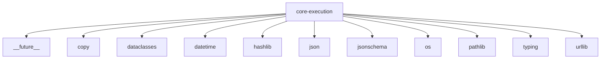

# Imports

[← Back to MODULE](MODULE.md) | [← Back to INDEX](../../INDEX.md)

## Dependency Graph

## Internal Dependencies

Dependencies within this module:

- `core`
- `re`

## External Dependencies

Dependencies from other modules:

- `__future__`
- `copy`
- `dataclasses`
- `datetime`
- `hashlib`
- `json`
- `jsonschema`
- `os`
- `pathlib`
- `typing`
- `urllib`
