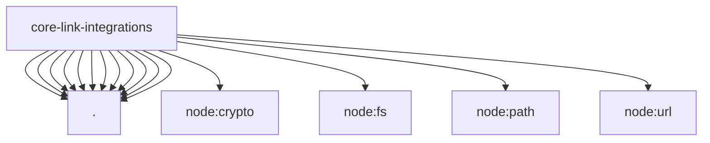

# Imports

[← Back to MODULE](MODULE.md) | [← Back to INDEX](../../INDEX.md)

## Dependency Graph

## External Dependencies

Dependencies from other modules:

- `./autowork.mjs`
- `./brain.mjs`
- `./config.mjs`
- `./errors.mjs`
- `./libraries.mjs`
- `./mcp.mjs`
- `./pins.mjs`
- `./platform.mjs`
- `./redaction.mjs`
- `./registry.mjs`
- `./skills.mjs`
- `./transport.mjs`
- `node:crypto`
- `node:fs`
- `node:path`
- `node:url`
