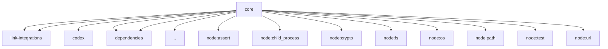

# Imports

[← Back to MODULE](MODULE.md) | [← Back to INDEX](../../INDEX.md)

## Dependency Graph

## External Dependencies

Dependencies from other modules:

- `../../../link-integrations/errors.mjs`
- `../../../link-integrations/skills-loader.mjs`
- `../codex/adapter.mjs`
- `../dependencies/spdx-expression-validate.mjs`
- `../library-client.mjs`
- `./dependencies/spdx-expression-validate.mjs`
- `node:assert/strict`
- `node:child_process`
- `node:crypto`
- `node:fs`
- `node:os`
- `node:path`
- `node:test`
- `node:url`
