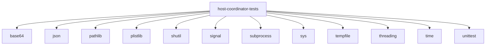

# Imports

[← Back to MODULE](MODULE.md) | [← Back to INDEX](../../INDEX.md)

## Dependency Graph

## Internal Dependencies

Dependencies within this module:

- `host`
- `os`

## External Dependencies

Dependencies from other modules:

- `base64`
- `json`
- `pathlib`
- `plistlib`
- `shutil`
- `signal`
- `subprocess`
- `sys`
- `tempfile`
- `threading`
- `time`
- `unittest`
