# Imports

[← Back to MODULE](MODULE.md) | [← Back to INDEX](../../INDEX.md)

## Dependency Graph

```mermaid
graph TD
    host_coordinator[host-coordinator] --> __future__[__future__]
    host_coordinator[host-coordinator] --> argparse[argparse]
    host_coordinator[host-coordinator] --> base64[base64]
    host_coordinator[host-coordinator] --> dataclasses[dataclasses]
    host_coordinator[host-coordinator] --> hashlib[hashlib]
    host_coordinator[host-coordinator] --> json[json]
    host_coordinator[host-coordinator] --> pathlib[pathlib]
    host_coordinator[host-coordinator] --> scripts[scripts]
    host_coordinator[host-coordinator] --> shlex[shlex]
    host_coordinator[host-coordinator] --> shutil[shutil]
    host_coordinator[host-coordinator] --> sqlite3[sqlite3]
    host_coordinator[host-coordinator] --> subprocess[subprocess]
    host_coordinator[host-coordinator] --> sys[sys]
    host_coordinator[host-coordinator] --> tempfile[tempfile]
    host_coordinator[host-coordinator] --> threading[threading]
    host_coordinator[host-coordinator] --> time[time]
    host_coordinator[host-coordinator] --> typing[typing]
    host_coordinator[host-coordinator] --> urllib[urllib]
    host_coordinator[host-coordinator] --> uuid[uuid]
```

## Internal Dependencies

Dependencies within this module:

- `os`
- `re`

## External Dependencies

Dependencies from other modules:

- `__future__`
- `argparse`
- `base64`
- `dataclasses`
- `hashlib`
- `json`
- `pathlib`
- `scripts`
- `shlex`
- `shutil`
- `sqlite3`
- `subprocess`
- `sys`
- `tempfile`
- `threading`
- `time`
- `typing`
- `urllib`
- `uuid`
