# Imports

[← Back to MODULE](MODULE.md) | [← Back to INDEX](../../INDEX.md)

## Dependency Graph

```mermaid
graph TD
    root[root] --> __future__[__future__]
    root[root] --> argparse[argparse]
    root[root] --> base64[base64]
    root[root] --> collections[collections]
    root[root] --> contextlib[contextlib]
    root[root] --> copy[copy]
    root[root] --> dataclasses[dataclasses]
    root[root] --> datetime[datetime]
    root[root] --> execution[execution]
    root[root] --> fcntl[fcntl]
    root[root] --> fnmatch[fnmatch]
    root[root] --> harness[harness]
    root[root] --> hashlib[hashlib]
    root[root] --> ide_development[ide_development]
    root[root] --> importlib[importlib]
    root[root] --> json[json]
    root[root] --> math[math]
    root[root] --> msvcrt[msvcrt]
    root[root] --> node_fs[node:fs]
    root[root] --> node_path[node:path]
    root[root] --> node_url[node:url]
    root[root] --> pathlib[pathlib]
    root[root] --> shutil[shutil]
    root[root] --> subprocess[subprocess]
    root[root] --> sys[sys]
    root[root] --> tempfile[tempfile]
    root[root] --> time[time]
    root[root] --> types[types]
    root[root] --> typing[typing]
    root[root] --> unittest[unittest]
    root[root] --> urllib[urllib]
    root[root] --> uuid[uuid]
    root[root] --> zoneinfo[zoneinfo]
```

## Internal Dependencies

Dependencies within this module:

- `administrator_recovery`
- `bugbot_user_credentials`
- `cleanup_controls`
- `coordinator`
- `core`
- `delivery_modes`
- `external_state_audit`
- `generated_output_closure`
- `github_auth`
- `gitops`
- `host`
- `issue_checkpoint`
- `os`
- `packager_coordinator`
- `packager_logic`
- `phase_integrator`
- `platform_matrix`
- `promotion_receipt_gate`
- `re`
- `readiness_status`
- `receipt_seal`
- `repair_task`
- `repository_protection`
- `review_ready_dispatch`
- `scripts`
- `secret_scan`
- `verify_reconciled_tree`
- `write_outcome`

## External Dependencies

Dependencies from other modules:

- `__future__`
- `argparse`
- `base64`
- `collections`
- `contextlib`
- `copy`
- `dataclasses`
- `datetime`
- `execution`
- `fcntl`
- `fnmatch`
- `harness`
- `hashlib`
- `ide_development`
- `importlib`
- `json`
- `math`
- `msvcrt`
- `node:fs`
- `node:path`
- `node:url`
- `pathlib`
- `shutil`
- `subprocess`
- `sys`
- `tempfile`
- `time`
- `types`
- `typing`
- `unittest`
- `urllib`
- `uuid`
- `zoneinfo`
