# Imports

[← Back to MODULE](MODULE.md) | [← Back to INDEX](../../INDEX.md)

## Dependency Graph

```mermaid
graph TD
    scripts_ide_development_tests[scripts-ide_development_tests] --> __future__[__future__]
    scripts_ide_development_tests[scripts-ide_development_tests] --> contextlib[contextlib]
    scripts_ide_development_tests[scripts-ide_development_tests] --> json[json]
    scripts_ide_development_tests[scripts-ide_development_tests] --> pathlib[pathlib]
    scripts_ide_development_tests[scripts-ide_development_tests] --> shutil[shutil]
    scripts_ide_development_tests[scripts-ide_development_tests] --> stat[stat]
    scripts_ide_development_tests[scripts-ide_development_tests] --> subprocess[subprocess]
    scripts_ide_development_tests[scripts-ide_development_tests] --> sys[sys]
    scripts_ide_development_tests[scripts-ide_development_tests] --> tempfile[tempfile]
    scripts_ide_development_tests[scripts-ide_development_tests] --> time[time]
    scripts_ide_development_tests[scripts-ide_development_tests] --> types[types]
    scripts_ide_development_tests[scripts-ide_development_tests] --> typing[typing]
    scripts_ide_development_tests[scripts-ide_development_tests] --> unittest[unittest]
```

## Internal Dependencies

Dependencies within this module:

- `ide_development`
- `ide_development_tests`
- `io`
- `os`

## External Dependencies

Dependencies from other modules:

- `__future__`
- `contextlib`
- `json`
- `pathlib`
- `shutil`
- `stat`
- `subprocess`
- `sys`
- `tempfile`
- `time`
- `types`
- `typing`
- `unittest`
