# Imports

[← Back to MODULE](MODULE.md) | [← Back to INDEX](../../INDEX.md)

## Dependency Graph

```mermaid
graph TD
    scripts_tests[scripts-tests] --> __future__[__future__]
    scripts_tests[scripts-tests] --> argparse[argparse]
    scripts_tests[scripts-tests] --> contextlib[contextlib]
    scripts_tests[scripts-tests] --> copy[copy]
    scripts_tests[scripts-tests] --> dataclasses[dataclasses]
    scripts_tests[scripts-tests] --> datetime[datetime]
    scripts_tests[scripts-tests] --> gitops[gitops]
    scripts_tests[scripts-tests] --> hashlib[hashlib]
    scripts_tests[scripts-tests] --> json[json]
    scripts_tests[scripts-tests] --> jsonschema[jsonschema]
    scripts_tests[scripts-tests] --> pathlib[pathlib]
    scripts_tests[scripts-tests] --> repair_observer[repair_observer]
    scripts_tests[scripts-tests] --> shutil[shutil]
    scripts_tests[scripts-tests] --> subprocess[subprocess]
    scripts_tests[scripts-tests] --> sys[sys]
    scripts_tests[scripts-tests] --> tempfile[tempfile]
    scripts_tests[scripts-tests] --> typing[typing]
    scripts_tests[scripts-tests] --> unittest[unittest]
```

## Internal Dependencies

Dependencies within this module:

- `core`
- `host`
- `io`
- `os`
- `re`
- `scripts`

## External Dependencies

Dependencies from other modules:

- `__future__`
- `argparse`
- `contextlib`
- `copy`
- `dataclasses`
- `datetime`
- `gitops`
- `hashlib`
- `json`
- `jsonschema`
- `pathlib`
- `repair_observer`
- `shutil`
- `subprocess`
- `sys`
- `tempfile`
- `typing`
- `unittest`
