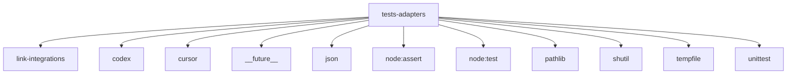

# Imports

[← Back to MODULE](MODULE.md) | [← Back to INDEX](../../INDEX.md)

## Dependency Graph

## Internal Dependencies

Dependencies within this module:

- `re`

## External Dependencies

Dependencies from other modules:

- `../../core/link-integrations/errors.mjs`
- `../../core/managed-core/platforms/codex/adapter.mjs`
- `../../core/managed-core/platforms/cursor/adapter.mjs`
- `__future__`
- `json`
- `node:assert/strict`
- `node:test`
- `pathlib`
- `shutil`
- `tempfile`
- `unittest`
