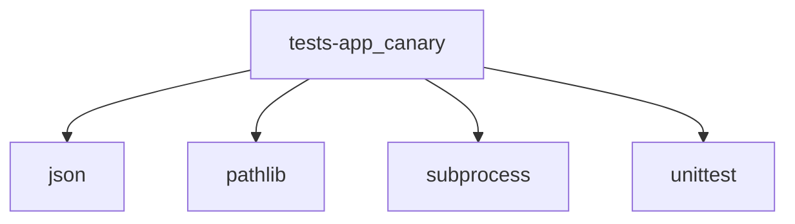

# Module: tests/app_canary

[← Back to INDEX](../../INDEX.md)

**Type:** python | **Files:** 2

**Entry point:** `tests/app_canary/__init__.py`

## Files

| File | Lines | Large |
| ---- | ----- | ----- |
| `tests/app_canary/__init__.py` | 1 |  |
| `tests/app_canary/test_app_canary.py` | 58 |  |

---

## External Dependencies

Dependencies from other modules:

- `json`
- `pathlib`
- `subprocess`
- `unittest`
