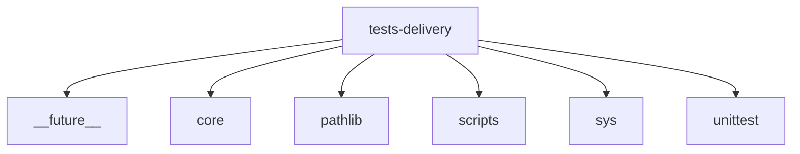

# Imports

[← Back to MODULE](MODULE.md) | [← Back to INDEX](../../INDEX.md)

## Dependency Graph

## External Dependencies

Dependencies from other modules:

- `__future__`
- `core`
- `pathlib`
- `scripts`
- `sys`
- `unittest`
