# Imports

[← Back to MODULE](MODULE.md) | [← Back to INDEX](../../INDEX.md)

## Dependency Graph

```mermaid
graph TD
    tests_execution_protocol[tests-execution_protocol] --> __future__[__future__]
    tests_execution_protocol[tests-execution_protocol] --> copy[copy]
    tests_execution_protocol[tests-execution_protocol] --> core[core]
    tests_execution_protocol[tests-execution_protocol] --> datetime[datetime]
    tests_execution_protocol[tests-execution_protocol] --> hashlib[hashlib]
    tests_execution_protocol[tests-execution_protocol] --> json[json]
    tests_execution_protocol[tests-execution_protocol] --> jsonschema[jsonschema]
    tests_execution_protocol[tests-execution_protocol] --> os[os]
    tests_execution_protocol[tests-execution_protocol] --> pathlib[pathlib]
    tests_execution_protocol[tests-execution_protocol] --> shutil[shutil]
    tests_execution_protocol[tests-execution_protocol] --> subprocess[subprocess]
    tests_execution_protocol[tests-execution_protocol] --> sys[sys]
    tests_execution_protocol[tests-execution_protocol] --> tempfile[tempfile]
    tests_execution_protocol[tests-execution_protocol] --> unittest[unittest]
```

## External Dependencies

Dependencies from other modules:

- `__future__`
- `copy`
- `core`
- `datetime`
- `hashlib`
- `json`
- `jsonschema`
- `os`
- `pathlib`
- `shutil`
- `subprocess`
- `sys`
- `tempfile`
- `unittest`
