# Imports

[← Back to MODULE](MODULE.md) | [← Back to INDEX](../../INDEX.md)

## Dependency Graph

```mermaid
graph TD
    tests_link_integrations[tests-link-integrations] --> link_integrations[link-integrations]
    tests_link_integrations[tests-link-integrations] --> link_integrations[link-integrations]
    tests_link_integrations[tests-link-integrations] --> link_integrations[link-integrations]
    tests_link_integrations[tests-link-integrations] --> link_integrations[link-integrations]
    tests_link_integrations[tests-link-integrations] --> link_integrations[link-integrations]
    tests_link_integrations[tests-link-integrations] --> link_integrations[link-integrations]
    tests_link_integrations[tests-link-integrations] --> link_integrations[link-integrations]
    tests_link_integrations[tests-link-integrations] --> link_integrations[link-integrations]
    tests_link_integrations[tests-link-integrations] --> link_integrations[link-integrations]
    tests_link_integrations[tests-link-integrations] --> link_integrations[link-integrations]
    tests_link_integrations[tests-link-integrations] --> link_integrations[link-integrations]
    tests_link_integrations[tests-link-integrations] --> link_integrations[link-integrations]
    tests_link_integrations[tests-link-integrations] --> link_integrations[link-integrations]
    tests_link_integrations[tests-link-integrations] --> link_integrations[link-integrations]
    tests_link_integrations[tests-link-integrations] --> codex[codex]
    tests_link_integrations[tests-link-integrations] --> cursor[cursor]
    tests_link_integrations[tests-link-integrations] --> node_assert[node:assert]
    tests_link_integrations[tests-link-integrations] --> node_fs[node:fs]
    tests_link_integrations[tests-link-integrations] --> node_path[node:path]
    tests_link_integrations[tests-link-integrations] --> node_test[node:test]
    tests_link_integrations[tests-link-integrations] --> node_url[node:url]
```

## External Dependencies

Dependencies from other modules:

- `../../core/link-integrations/autowork.mjs`
- `../../core/link-integrations/brain.mjs`
- `../../core/link-integrations/clients.mjs`
- `../../core/link-integrations/config.mjs`
- `../../core/link-integrations/errors.mjs`
- `../../core/link-integrations/libraries.mjs`
- `../../core/link-integrations/mcp.mjs`
- `../../core/link-integrations/pins.mjs`
- `../../core/link-integrations/platform.mjs`
- `../../core/link-integrations/redaction.mjs`
- `../../core/link-integrations/registry.mjs`
- `../../core/link-integrations/skills-loader.mjs`
- `../../core/link-integrations/skills.mjs`
- `../../core/link-integrations/transport.mjs`
- `../../core/managed-core/platforms/codex/skills-loader.mjs`
- `../../core/managed-core/platforms/cursor/skills-loader.mjs`
- `node:assert/strict`
- `node:fs`
- `node:path`
- `node:test`
- `node:url`
