# Imports

[← Back to MODULE](MODULE.md) | [← Back to INDEX](../../INDEX.md)

## Dependency Graph

```mermaid
graph TD
    tests_managed_core_migration_bb_harness[tests-managed-core-migration-bb-harness] --> __future__[__future__]
    tests_managed_core_migration_bb_harness[tests-managed-core-migration-bb-harness] --> dataclasses[dataclasses]
    tests_managed_core_migration_bb_harness[tests-managed-core-migration-bb-harness] --> hashlib[hashlib]
    tests_managed_core_migration_bb_harness[tests-managed-core-migration-bb-harness] --> ide_development[ide_development]
    tests_managed_core_migration_bb_harness[tests-managed-core-migration-bb-harness] --> json[json]
    tests_managed_core_migration_bb_harness[tests-managed-core-migration-bb-harness] --> os[os]
    tests_managed_core_migration_bb_harness[tests-managed-core-migration-bb-harness] --> pathlib[pathlib]
    tests_managed_core_migration_bb_harness[tests-managed-core-migration-bb-harness] --> shutil[shutil]
    tests_managed_core_migration_bb_harness[tests-managed-core-migration-bb-harness] --> stat[stat]
    tests_managed_core_migration_bb_harness[tests-managed-core-migration-bb-harness] --> subprocess[subprocess]
    tests_managed_core_migration_bb_harness[tests-managed-core-migration-bb-harness] --> sys[sys]
    tests_managed_core_migration_bb_harness[tests-managed-core-migration-bb-harness] --> tempfile[tempfile]
    tests_managed_core_migration_bb_harness[tests-managed-core-migration-bb-harness] --> typing[typing]
```

## Internal Dependencies

Dependencies within this module:

- `re`

## External Dependencies

Dependencies from other modules:

- `__future__`
- `dataclasses`
- `hashlib`
- `ide_development`
- `json`
- `os`
- `pathlib`
- `shutil`
- `stat`
- `subprocess`
- `sys`
- `tempfile`
- `typing`
