# Imports

[← Back to MODULE](MODULE.md) | [← Back to INDEX](../../INDEX.md)

## Dependency Graph

```mermaid
graph TD
    tests_platform_matrix[tests-platform_matrix] --> __future__[__future__]
    tests_platform_matrix[tests-platform_matrix] --> dataclasses[dataclasses]
    tests_platform_matrix[tests-platform_matrix] --> ide_development[ide_development]
    tests_platform_matrix[tests-platform_matrix] --> ide_development_tests[ide_development_tests]
    tests_platform_matrix[tests-platform_matrix] --> json[json]
    tests_platform_matrix[tests-platform_matrix] --> pathlib[pathlib]
    tests_platform_matrix[tests-platform_matrix] --> shutil[shutil]
    tests_platform_matrix[tests-platform_matrix] --> stat[stat]
    tests_platform_matrix[tests-platform_matrix] --> subprocess[subprocess]
    tests_platform_matrix[tests-platform_matrix] --> sys[sys]
    tests_platform_matrix[tests-platform_matrix] --> tempfile[tempfile]
    tests_platform_matrix[tests-platform_matrix] --> time[time]
    tests_platform_matrix[tests-platform_matrix] --> traceback[traceback]
    tests_platform_matrix[tests-platform_matrix] --> typing[typing]
    tests_platform_matrix[tests-platform_matrix] --> unittest[unittest]
```

## Internal Dependencies

Dependencies within this module:

- `os`
- `platform`
- `platform_matrix`

## External Dependencies

Dependencies from other modules:

- `__future__`
- `dataclasses`
- `ide_development`
- `ide_development_tests`
- `json`
- `pathlib`
- `shutil`
- `stat`
- `subprocess`
- `sys`
- `tempfile`
- `time`
- `traceback`
- `typing`
- `unittest`
