# Imports

[← Back to MODULE](MODULE.md) | [← Back to INDEX](../../INDEX.md)

## Dependency Graph

```mermaid
graph TD
    tests_security_acceptance[tests-security_acceptance] --> __future__[__future__]
    tests_security_acceptance[tests-security_acceptance] --> argparse[argparse]
    tests_security_acceptance[tests-security_acceptance] --> cleanup_controls[cleanup_controls]
    tests_security_acceptance[tests-security_acceptance] --> contextlib[contextlib]
    tests_security_acceptance[tests-security_acceptance] --> gitops[gitops]
    tests_security_acceptance[tests-security_acceptance] --> ide_development[ide_development]
    tests_security_acceptance[tests-security_acceptance] --> io[io]
    tests_security_acceptance[tests-security_acceptance] --> os[os]
    tests_security_acceptance[tests-security_acceptance] --> pathlib[pathlib]
    tests_security_acceptance[tests-security_acceptance] --> shutil[shutil]
    tests_security_acceptance[tests-security_acceptance] --> subprocess[subprocess]
    tests_security_acceptance[tests-security_acceptance] --> sys[sys]
    tests_security_acceptance[tests-security_acceptance] --> tempfile[tempfile]
    tests_security_acceptance[tests-security_acceptance] --> time[time]
    tests_security_acceptance[tests-security_acceptance] --> typing[typing]
    tests_security_acceptance[tests-security_acceptance] --> unittest[unittest]
```

## Internal Dependencies

Dependencies within this module:

- `harness`
- `json`
- `re`

## External Dependencies

Dependencies from other modules:

- `__future__`
- `argparse`
- `cleanup_controls`
- `contextlib`
- `gitops`
- `ide_development`
- `io`
- `os`
- `pathlib`
- `shutil`
- `subprocess`
- `sys`
- `tempfile`
- `time`
- `typing`
- `unittest`
