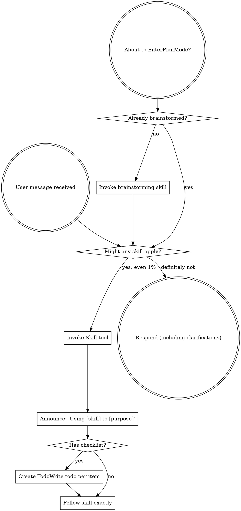

# Post-SSH transcript messages from abe8cc85

- Source: `/Users/linktrend/.cursor/projects/Users-linktrend-Projects-IDE-Development/agent-transcripts/abe8cc85-3af6-44a8-9c21-74e7c29611ed/abe8cc85-3af6-44a8-9c21-74e7c29611ed.jsonl`
- Chat UI title observed: **Cursor setup and configuration**
- SSH-ending assistant message: jsonl line **122** (last message visible in IDE UI)
- Records below: **94** subsequent jsonl messages

---

## Message 1 · jsonl L123 · role=`user` · Friday, Jul 24, 2026, 6:08 PM (UTC+8)

### User query

Now we need to talk about work trees, GitHub, remotes, branches, etc. I believe, if I'm not mistaken, that in the repo in this workspace called IDE Development, there must be a definition of the GitHub strategy that I went through and determined. I have done this 20 times, and I don't want to do it again. Please go and search the IDE Development repo and present to me your understanding of how the agents need to behave when doing work:
- Do they open a branch or open a work tree?
- How do they close a branch?
- How do they close a work tree?
- What branches exist and need to exist?
- How do things get committed, promoted, PR, etc.? I do not understand GitHub and all the lingo around it, like diffs and CICD. I do not understand any of it. In my mental mode, GitHub is a backup of the codebase that lives on the local drive, but I know that GitHub actually needs to be the source of truth, especially now that we are going to be using cloud agents. That means that GitHub needs to always be updated. That means that when an agent anywhere is going to do something, he has to do it on a particular branch and commit, and then that branch gets all integrated and merged and promoted so that everything is uniform across all machines, across all agents.

---

## Message 2 · jsonl L124 · role=`assistant`

Searching IDE Development for the Git/branching strategy you already defined so we can restate it in plain English—no redesign.
[tool_use: Grep]

[tool_use: Glob]

[tool_use: Glob]

---

## Message 3 · jsonl L125 · role=`assistant`

[tool_use: Read]

[tool_use: Read]

[tool_use: Grep]

[tool_use: Grep]

---

## Message 4 · jsonl L126 · role=`assistant`

[tool_use: Glob]

[tool_use: Read]

[tool_use: Grep]

[tool_use: Grep]

---

## Message 5 · jsonl L127 · role=`assistant`

[tool_use: Read]

[tool_use: Grep]

---

## Message 6 · jsonl L128 · role=`assistant`

Found your existing rule. It’s already defined — mainly in `.cursor/rules/01-git-branching.mdc`, plus `.github/workflows/branch-source-policy.yml` and the Technical PRD. Here’s that model in plain English (no redesign).

---

## Mental model (corrected)

| Old idea | Studio rule |
|---|---|
| GitHub is only a backup of the Mac | **GitHub is the shared official copy** |
| Each machine’s disk is the truth | Disk is a **checkout**; after push, **GitHub** is what others (and Cloud Agents) see |
| Agents edit “the folder” freely | Agents edit on a **work branch**, then **merge into the shared lines** |

Think of three **shared drawers** on GitHub that every machine and cloud agent must respect:

1. **`development`** — where all finished agent work is collected and checked for conflicts  
2. **`staging`** — testing / dress rehearsal (you promote here)  
3. **`main`** — production (you promote here)

Agents never dump straight into `staging` or `main`.

---

## What branches exist

### Always (on each product repo)

| Branch | Purpose | Who merges into it |
|---|---|---|
| **`development`** | Integration — accumulate agent work | **Integrator** (from work branches via PR) |
| **`staging`** | Test before production | **You (Principal)** — only from `development` |
| **`main`** | Live / production | **You (Principal)** — only from `staging` |

### Temporary (per piece of work)

| Branch name | When |
|---|---|
| **`issue/<id>-<slug>`** | Formal factory issue (preferred for governed work) |
| **`dev/<machine><ide>`** | Ad-hoc IDE work (e.g. `dev/minicursor/…`) |
| Also allowed into `development`: `feature/*`, `fix/*`, `chore/*`, `cursor/*`, `codex/*`, … | Short-lived work |

Your Cursor Agent branch prefix `dev/minicursor/` fits this. Cloud Agents using `cursor/` also fit the allowlist.

---

## Branch vs worktree (what agents should do)

Your **written strategy is branch-based**, not “must use worktrees.”

| Tool | What it is | Required by your docs? |
|---|---|---|
| **Branch** | A named line of work on GitHub (`issue/…` or `dev/…`) | **Yes** |
| **Worktree** | An extra folder on disk so an agent can work on a branch without touching your main checkout | **Optional** (Cursor feature; useful for parallel agents) |

**Default agent behavior:**

1. Start from latest **`development`** (pull/push so GitHub is current)  
2. Create/checkout **`issue/…`** or **`dev/minicursor/…`** (or `cursor/…` for cloud)  
3. Optionally use a **worktree** for that branch if isolating parallel work  
4. Commit → **push that branch to GitHub**  
5. Open a **PR into `development`**  
6. After merge, delete the work branch; remove the worktree if one was used  

**Close a branch:** after it’s merged into `development` (or abandoned), delete the remote/local branch.  
**Close a worktree:** remove the extra folder / Cursor-managed worktree after the branch is merged or abandoned — don’t leave orphans forever (your Worktrees settings cap at 25 / 50 GB).

---

## How work gets committed, reviewed, and promoted

```
Agent works on issue/* or dev/* or cursor/*
        ↓
  Commit (conventional: type(scope): summary)
        ↓
  Push branch to GitHub   ← Cloud Agents / other machines can see it
        ↓
  Pull Request → development
        ↓
  CI checks run (automated “does this break anything?”)
        ↓
  Integrator merges into development   ← when merge-ready / review passed
        ↓
  You: development → staging   (Principal only)
        ↓
  You: staging → main          (Principal only)
```

**Agents should:** commit on the work branch, push, open PR to **`development`**.  
**Agents should not:** push/merge to `staging` or `main` (that’s you).

Safety habits (from `git-safeguard`): don’t commit secrets; don’t mix unrelated files; know the branch before push.

---

## Lingo in one breath

| Word | Plain meaning |
|---|---|
| **Commit** | A saved snapshot of changes with a message |
| **Push** | Upload those commits to GitHub |
| **Branch** | A parallel line of work |
| **PR (pull request)** | “Please review and merge my branch into that branch” |
| **Merge** | Fold that work into the target branch |
| **Diff** | The list of what changed (before vs after) |
| **CI/CD** | Robots that run tests/checks on GitHub when you open a PR or push; CD is deploying — your promote to staging/main is the controlled human step |

---

## For Remote Control + Cloud Agents

- **GitHub must stay updated** → agents **push** their work branches; don’t leave weeks of work only on the Mini disk  
- Cloud Agents clone **GitHub**, not your unsaved Mini folder  
- Long-lived Remote Control agents still follow the same branch → PR → `development` rules  

---

## Source of truth (so you don’t redo this)

1. `.cursor/rules/01-git-branching.mdc`  
2. `.github/workflows/branch-source-policy.yml`  
3. Technical PRD § git / CI (Integrator → `development`; Principal → `staging`/`main`)

---

**Bottom line for agents:** Always work on a **short-lived branch** (issue/dev/cursor), **commit + push to GitHub**, **PR into `development`**. Worktrees are optional isolation. You alone promote `development` → `staging` → `main`.

If you want a one-page “Agent Git cheat sheet” checked into IDE Development next, say so — still based only on this existing strategy, not a new one.

---

## Message 7 · jsonl L129 · role=`user` · Friday, Jul 24, 2026, 6:24 PM (UTC+8)

### User query

Files and do not execute anything. Do not change any files and do not execute anything yet. We are discussing.

1. Should there be any mention of CI or CD in the cursor rules and GitHub workflows source of truth that you have found?

2. Agents don't seem to be following these rules when doing their work. I don't know what work branches they open, if they pull, or I don't know anything. I believe that the agent should already know and should perhaps do the commit, push, and merge into development automatically, or is it something that we need to set up with automations? If we set it up with automations, then I think that we need to do it so that it happens a couple times a day. I don't know. What is your professional opinion if you adopt the role of a full-stack developer with 30 years of experience?

3. I think I'm okay with me doing the promotion from staging to main, but I think that the promotion from development to staging is just going through the CI/CD checks, the robots tests, and checks. If everything is green, then it's okay, and it should get automatically promoted to staging. I even think that the CI/CD, when promoting from staging to main, should also be automatic so that all the tests and checks pass. Only if there are red flags should those red flags be addressed. If not, then the automatic promotion to main also should happen. One of the problems that I'm having is that the agents do not commit to their work branch and then push those commits to the development branch as a PR. I don't know who is responsible for merging those PRs into the development branch. At the very least, all the agents know that twice a day the development branch is updated with all of the agents' work, and then they pull the development branch to do development work. They get more or less most updated. I don't understand PRs, the pull requests. Who reviews it under the current rules? I am not a developer, so there should be an agent within a workspace, or a cloud agent, I don't know, or a bot in GitHub that could be responsible for reviewing all of the pull requests and approving them and then merging them into the branches.

4. "Close a worktree: remove the extra folder / Cursor-managed worktree after the branch is merged or abandoned — don’t leave orphans forever (your Worktrees settings cap at 25 / 50 GB). - Is it not true that 25 and 50 GB of cap for work trees is a lot? Just asking, I don't know.

5. I understand your findings that work trees are optional, but then how would I know if a work tree has been opened or remained open? The agents are not following the rules of doing the commit every now and then, or at the end of the day, or however it's supposed to be, and opening a pull request. I don't know who is supposed to review the pull requests and merge into the branch and then promote from that branch to the other branch. All I know is that I have a whole bunch of robots in GitHub that are constantly failing and filling up my email with 50 to 100 emails a day of errors and things not passing the checks. What is a good design that is as autonomous as possible?

---

## Message 8 · jsonl L130 · role=`assistant`

Discussion only — no changes, no commands. Checking one existing promotion workflow so the advice matches what’s already in the repo.
[tool_use: Read]

[tool_use: Grep]

---

## Message 9 · jsonl L131 · role=`assistant`

## 1) Should CI/CD be in the rules / workflows SOT?

**Yes — lightly, not as a novel.**

What you already have:

- **Rules** (`.cursor/rules/01-git-branching.mdc`): who may merge where  
- **Workflows**: robots that enforce branch sources + run checks; you even have a **Monday** `development → staging` helper  

What’s missing for agents: a short “when you finish work” checklist in rules (branch → commit → push → PR → wait for CI → do not self-merge to staging/main).  
CI details stay in `.github/workflows/`; rules should **point** there, not duplicate YAML.

**CD** (deploy live) is different from **CI** (tests on GitHub). Your Intent today still says product promote to live needs **Principal Release OK**. That’s a policy choice, not a GitHub limitation.

---

## 2) Why agents ignore this — and what I’d do (30-year view)

Agents don’t “know” GitHub strategy unless it’s **forced by process + automation**. Rules alone are polite suggestions.

| Approach | Reality |
|---|---|
| Hope agents remember | Fails (what you’re seeing) |
| Stronger rules + every session reminder | Helps a bit |
| **Automations + branch protection** | What actually works |

**Professional opinion — recommended design:**

**A. Agents (local / Remote Control / Cloud) must:**

1. Branch from latest `development`  
2. Commit often on **their** work branch  
3. **Push** that branch  
4. Open **PR → `development`**  
5. Stop (or babysit CI). **Do not** merge to `staging`/`main`

**B. Automations (not “agent memory”) should:**

| Job | Who | Cadence |
|---|---|---|
| Remind / open missing PRs for unpushed or undrafted branches | Cursor Automations or a small bot | 2×/day (e.g. 12:00 and 18:00 Taipei) is reasonable |
| **Review** PRs into `development` | Dedicated **Reviewer** agent or Bugbot — not the implementer | On every PR |
| **Merge** into `development` when CI green + review pass | **Integrator** bot/agent | On PR ready |
| Refresh local/cloud from `development` | Agents pull at session start; optional 2×/day sync note | Always at start of work |

Merging to `development` should **not** wait for a twice-daily batch if CI is green — merge when ready. Twice-daily is better for **“sweep unfinished branches / nag unpushed work”** and **“everyone pull development.”**

So: **both** — agents do commit/push/PR; **automation** owns review+merge into `development` and nagging. Don’t rely on agents to self-merge into `development` without a separate reviewer role (your own doctrine forbids implementer = sole reviewer).

---

## 3) Auto `development → staging` and `staging → main` — and who reviews PRs

### Who reviews / merges **today** (your written rules)

| Step | Who |
|---|---|
| Work on `issue/*` / `dev/*` / `cursor/*` | Implementer agent |
| Independent check of the work | **Reviewer** agent (separate) |
| Merge PR into **`development`** | **Integrator** (only) |
| `development` → **`staging`** | **Principal** (you) — docs say |
| `staging` → **`main`** | **Principal** (you) — docs say |

You are **not** supposed to personally review every code PR. An **agent or GitHub bot** should. If nobody is assigned Integrator/Reviewer in practice, PRs pile up or agents skip PRs entirely — matching what you see.

### Your idea: auto-promote if CI green

That’s a **valid autonomous ops model**, but it **conflicts** with current Intent/PRD (“no auto product promotion without Principal Release OK”).

**My recommendation (pragmatic split):**

| Promotion | Suggestion |
|---|---|
| **Work branch → `development`** | Fully autonomous: CI green + Reviewer/Bugbot approve → **Integrator merges** |
| **`development` → `staging`** | **Auto OK** if CI on that PR is green (you already have a Monday scheduled path — could make it daily or on-green). Staging = “integrated build under test,” not production |
| **`staging` → `main`** | **Auto only if** you accept “main = whatever passed staging CI.” Safer for a non-dev Principal: auto **propose** the PR and notify you; one tap approve — or auto-merge after N hours green with easy rollback. Many studios keep a human on **production** only |

Email storm (50–100 failures/day): usually means CI is red on many branches/PRs and notifications aren’t filtered. Fixing autonomy **and** quieting noise go together: fewer broken PRs, branch protection, notification rules to “failing on `development`/`staging`/`main` only.”

**PRs in one sentence:** a PR is a formal “please put my branch into that branch.” Reviewer checks it; Integrator merges into `development`; robots (CI) must be green first.

---

## 4) Are 25 worktrees / 50 GB a lot?

**Yes, generous** for one Mini.

| Cap | Verdict |
|---|---|
| 25 worktrees | High if agents leave orphans; **10–15** is plenty for your 4 workspaces |
| 50 GB | High; **15–20 GB** is saner unless trading/legal clones are huge |

Not urgent. Lower when disk gets tight. Bigger issue: **detecting orphans**, not the number itself.

---

## 5) How you’d know worktrees exist + a good autonomous design

**See worktrees today:**

- Cursor Settings → Worktrees → “Cursor-managed worktrees”  
- Or on Mini: Agents Window worktree UI / `git worktree list` (when you ask an agent later)

If agents don’t commit/PR, worktrees become invisible junk. Caps only limit damage.

---

### Target design (as autonomous as possible, Principal stays non-dev)

```
Every agent session
  → pull development
  → work on issue/* or cursor/* or dev/minicursor/*
  → commit + push often
  → open PR → development

On every PR to development
  → CI runs (robots)
  → Reviewer agent or Bugbot reviews
  → if green + approve → Integrator merges
  → delete branch + remove worktree

2× per day (automation)
  → sweep: unpushed / no-PR branches → open PR or alert
  → optional: “pull development” reminder for long-lived agents

development → staging
  → automatic when CI green (daily or on merge)   [policy change from “Principal only”]

staging → main
  → preferred: auto-PR + notify you / one-click
  → or fully auto only after you explicitly accept that policy
```

**You do not** personally merge agent PRs into `development`.  
**You do** own policy for production (`main`), until you formally change Intent.

---

### Why you’re drowning in failure emails

Likely: many PRs/branches, failing checks, notifications on everything. Autonomy without **green CI + one Integrator path** multiplies noise. Design above reduces both chaos and mail.

---

## Bottom line

1. **Yes** — mention CI in rules as a pointer; keep workflow YAML as the robot SOT.  
2. **Agents alone won’t comply** — enforce with **PR + Reviewer + Integrator automation**; 2×/day sweeps for leftovers.  
3. **Auto `development→staging`** is reasonable; **auto `staging→main`** is a deliberate policy change vs current docs — I’d auto-merge to `development`, auto to `staging`, keep you in the loop for `main` until you’re comfortable.  
4. **25 / 50 GB** is a lot; fine for now.  
5. **Best design:** branch → push → PR → bot review → auto-merge to `development` → auto/scheduled to `staging` → controlled `main`; worktrees optional and cleaned after merge.

When you want to **change policy in docs/rules/automations**, say so — until then this stays discussion only, as you asked.

---

## Message 10 · jsonl L132 · role=`user` · Friday, Jul 24, 2026, 6:48 PM (UTC+8)

### User query

Do not change anything. Do not execute anything. We're still discussing.

1. First of all, we are going to change the rules. I don't want your suggestion or your proposal to be constrained because of what the rules and the work fields currently say. I am going to tell you already some things regarding your response that I think we can change in order to make my life easier because I am one person developing everything:

a. Your 2B - remind open missing PRs for unpushed or undrafted branches. A cursor automation or a small bot. I don't know what a small bot means. I understand cursor automation, and then you say twice a day. I would actually like to propose that it be done five times a day:
1. At 7:00 AM
2. At 10:15 AM
3. At 12:30 PM
4. At 2:45 PM
5. At 6:00 PM  

During those windows, the whole process should happen automatically. By the whole process, I mean all agents (local, remote control, cloud, etc.) need to:
1. Commit their work on their work branch.
2. Push that branch.
3. Open a PR for the development branch.
4. The dedicated reviewer agent or Bum-Bot, whatever, reviews the PR into development as the PRs come in.
5. The integrator bot or agent will merge the PRs into development when the CI is green and the review passes.

At this time, the development branch should be updated and should be the same, and when agents are instructed to pull, they all pull from the same source. My next point is that I think agents also automatically need to think or pull from the development branch several times a day. I say also four times a day:
- 7:45 a.m.
- 11:00 a.m.
- 1:15 p.m.
- 3:30 p.m.
- 6:30 p.m.

The above is assuming that there's enough time (45 minutes) for the agents and reviewers and integrators and et cetera to do all of the work, and everything is merged in 45 minutes into that development branch.

by the way, at the following times when work will resume, then all agents are working off of the latest pull of the development branch

b. I know that now the docs say that there's a time on Mondays and Sundays to do certain actions. I think we need to clear that out now that I understand a bit better. The next thing that needs to be done is to promote development into staging. That actually can happen twice a week. I don't think that it should happen more often than that. Also, I think it should be automated. I know it says that I am the one that needs to do the promotion, but no, because actually, if this can be done by automations or by bots or agents, whatever, all they're doing is checking that everything passes. If it doesn't pass, then they fix it and then autopromote into staging. Promote from staging to main, I think, should be automated to make sure that the CI and everything is green and ready and there are no issues. All I would need to do is somehow approve and say go ahead. I think this could be done once a week

c. for point four, regarding the 50 GB and the 25 work trees, I'm going to go with your recommendation as to how we are going to deal with work trees. Do we allow agents to open work trees, or do we not allow it? If we allow it, what are the rules? Also, what are the caps as well

2. what I would like you to do is to take the above into consideration. Don't be constrained by the rules. Be guided and influenced by the rules because now I understand the rules better. Don't be constrained by the workflows and whatever is already in the.github folder, but be inspired by it. I would like you to propose the whole design as autonomous as possible. one thing that I want you to take into consideration is that I have one OpenClaw agent, which is being trained to be my clone. I would want somehow for her to be updated that these things are happening, or that she can be checking somehow that these things are happening so she can alert me if there is a break or issue in the process. Also, please note that in the future there will also be an OpenClaw that will be my CTO, dedicated to overseeing all of this.

---

## Message 11 · jsonl L133 · role=`assistant`

Discussion only — design proposal. Not changing files or running anything.

---

# Autonomous Git / promote design (Principal-friendly)

Guided by your existing branch names and Integrator/Reviewer idea; **not** limited by “Principal must click staging/main” in today’s docs.

---

## Plain roles

| Role | Who | Job |
|---|---|---|
| **Implementer** | Local / Remote Control / Cloud agents | Branch → commit → push → PR to `development` |
| **Reviewer** | Dedicated agent or Bugbot (not the author) | Review PRs into `development` |
| **Integrator** | Bot/agent | Merge into `development` when CI green + review pass |
| **Promoter** | Automation | `development`→`staging` (scheduled); open `staging`→`main` for your OK |
| **Lisa (OpenClaw clone)** | Monitors + alerts you | “Pipeline healthy / stuck / red” |
| **Future CTO OpenClaw** | Oversight | Policy, exceptions, studio-wide health |
| **You** | Principal | Approve **`staging`→`main`** once/week; intervene on red alerts |

“Small bot” = mostly **GitHub Actions + Cursor Automations**, not a person. Same idea as robots already in `.github/workflows/`.

---

## A. Daily integration rhythm (Taipei time)

### Wave 1 — “Ship what’s on the desk” (5×/day)

**07:00 · 10:15 · 12:30 · 14:45 · 18:00**

Automation tells every long-lived agent (local / Remote Control / cloud):

1. Commit on **your work branch** (if there are changes)  
2. Push to GitHub  
3. Open or update **PR → `development`**  
4. Reviewer reviews as PRs appear  
5. Integrator merges when **CI green + review pass**

Goal: after each wave, `development` on GitHub is the shared truth.

### Wave 2 — “Everyone sync” (5×/day, ~45 min after ship waves)

**07:45 · 11:00 · 13:15 · 15:30 · 18:30**

All agents **pull latest `development`** (rebase or merge per one fixed rule — recommend **merge from `development`** for non-experts; rebase only if Integrator enforces it).

Then normal work continues on their work branches.

### Honest limit on “45 minutes”

CI + review + merge often **won’t** finish in 45 minutes for every PR.

**Design rule:**  
- Ship wave **starts** the pipeline at those times.  
- Sync wave **pulls whatever is already merged**.  
- Anything still open **rolls to the next ship wave** — no blocking all agents for 45 minutes.  
- Lisa alerts if a PR is still open after **2 ship waves** or CI red > N hours.

That keeps your rhythm without a fragile “everything must finish in 45 minutes” assumption.

---

## B. Promotion (replace Monday-only thinking)

| Step | Cadence | How | Your involvement |
|---|---|---|---|
| Work branch → **`development`** | Continuous + 5× ship waves | Reviewer + Integrator + CI | None day-to-day |
| **`development` → `staging`** | **2×/week** (e.g. **Tue 09:00** and **Fri 09:00** Taipei) | Automation: if CI green, merge/promote; if red, **fix agent** then retry | None unless Lisa says stuck |
| **`staging` → `main`** | **1×/week** (e.g. **Fri 17:00** or **Mon 09:00**) | Automation opens PR + CI; **you approve “go”** | **One approval** |
| Clear old “Sunday/Monday-only” product promote folklore | — | Replace with this calendar | — |

Staging twice a week is enough for one-person studio. Main once a week with your OK keeps production conscious without you reading diffs.

---

## C. Worktrees — allow or not?

**Allow, with strict rules** (good for parallel agents; bad if unmanaged).

| Rule | Detail |
|---|---|
| When allowed | Parallel tasks, or agent must not dirty the main checkout |
| Naming | Worktree = one work branch (`issue/…`, `cursor/…`, `dev/minicursor/…`) |
| Lifecycle | Create with branch → work → ship wave commits/pushes/PR → after merge or abandon → **delete worktree** |
| Forbidden | Long-lived worktrees with no PR; worktrees on `staging`/`main` |
| Caps | **Max 12 worktrees**, **20 GB** total (down from 25 / 50) |
| Visibility | Ship-wave automation lists open worktrees; Lisa alerts if count > 8 or age > 48h without PR |

If you prefer maximum simplicity later: **ban worktrees** and only use branches in the main folder — fewer surprises, less parallelism.

**Recommendation for you now:** **allow with the rules above.**

---

## D. End-to-end autonomous loop

```
Agent session starts
  → ensure on work branch (from development)
  → implement

Ship windows (5×)
  → commit / push / PR→development
  → Reviewer
  → CI
  → Integrator merges → development updated

Sync windows (5×)
  → all agents pull development
  → continue work

Tue/Fri
  → auto development→staging (fix-if-red, then promote)

Weekly
  → staging→main PR + CI
  → you: Approve
  → merge to main
```

GitHub stays source of truth; Mini/MacBook/Cloud all follow `development` after sync waves.

---

## E. Lisa (clone) and future CTO

### Lisa — monitor & alert (now)

She does **not** merge code. She watches:

- Ship/sync waves ran (or failed)  
- Open PRs into `development` older than 2 waves  
- CI red on `development` / `staging` / `main`  
- Worktree count / orphans  
- Staging promote skipped (red)  
- Weekly main PR waiting for your approval  

**Alert you** (Slack / message) with: what’s broken, which repo, link, suggested next action.

Optional: daily 1-page “pipeline status” at 19:00.

### Future CTO OpenClaw

- Owns policy exceptions (“skip sync today”, “hotfix to main”)  
- Escalates repeated red CI  
- Coordinates multi-repo promote order  
- Lisa remains your personal alert layer; CTO owns studio engineering process  

Wire both to the **same status signals** (GitHub checks + Cursor Automations logs + a small status doc or channel).

---

## F. What you stop doing

- Manually wondering if agents committed  
- Merging PRs into `development` yourself  
- Promoting `development`→`staging` yourself  
- Reading every diff  

**What you still do**

- Weekly **Approve** `staging`→`main`  
- Act on Lisa alerts when something is stuck  

---

## G. Implementation layers (when you say “build it” later)

1. **Rules** rewrite: ship/sync cadence, worktree policy, no Principal on staging  
2. **Cursor Automations**: 5 ship + 5 sync triggers; PR babysit  
3. **GitHub**: branch protection on `development`/`staging`/`main`; Integrator merge rights; CI required  
4. **Schedule**: 2×/week staging; 1×/week main-for-approval  
5. **Lisa**: webhook/digest on failures + waiting approvals  
6. Retire/replace Monday-only promote folklore in docs  

---

## H. Decisions to confirm before any future build

1. **Timezone:** Asia/Taipei for all clocks?  
2. **Staging days:** Tue + Fri 09:00 OK?  
3. **Main:** Fri evening vs Monday morning for your Approve?  
4. **Worktrees:** Allow with 12 / 20 GB (recommended) or ban?  
5. **Reviewer:** Cursor Bugbot vs dedicated Reviewer agent vs both?  
6. **If CI still red at next ship wave:** auto-spawn fix agent (yes/no)?  

---

**Bottom line:** Five ship waves + five sync waves, auto merge to `development`, auto `development`→`staging` twice weekly, weekly `staging`→`main` with your one approval, worktrees allowed under caps, Lisa watches and alerts, CTO later oversees. The 45-minute gap is a **start sync**, not a hard “everything finished” gate.

Say which of H1–H6 you want, and we can lock a final design doc wording — still discussion-only until you ask to write files.

---

## Message 12 · jsonl L134 · role=`user` · Friday, Jul 24, 2026, 7:21 PM (UTC+8)

### User query

The following are my non-technical layman's suggestions to your proposed design. Do not implement the design yet. We're still discussing the design:

1. Your A. Since you believe that 45 minutes is not enough in order to do the wave one ship that's on the desk so that wave two can proceed, then we need to change the timings. I suggest then the following:

Development branches should be ready to pull by the following times:
8am
6pm

So if you believe that say 2 hours is needed to do wave 1 then we should have 2 waves at 6am and 4pm, if you think 90 min is enough then adjust accordingly.

2. Your B. development → staging - I prefer Tuesday and Friday 8am; staging → main Mondays at 8am (I might give the approval at 830am or via Lisa.)

3. Dont refer to Lisa as a clone that was for your information. Lisa's role is fine but I first want to clarify something:

Lets be deterministic about who does things and what is it in plain english:

Dedicated agent or Bugbot (not the author), 	
Bot/agent, automation :

Are these agents in Cursor (what type). Does that mean that is a cloud agent, or is it an agent that is in remote control? Can it not be a local agent? You say Bugbot. I know that there is something on cursor.com that is called Bugbot, but I don't know anything about it. I don't know how it works, but my point here is that the implementer is going to commit and push PR into development. That has to be done by an automation that tells the agent to do this. Please explain. Then the reviewer will review the PRs into development. What if there are alerts, issues, or anything? Would the reviewer then fix the issue, the alert, or anything until everything is clear, or does the reviewer just push PR into development? Then it's the integrator that merges into development when CI is green and the review passes. What if CI is not green and the review doesn't pass? Does the integrator then do all of the fixes and make sure that eventually everything is green and passes, or does the integrator send it back to the implementer to redo things and then start the whole process again? The whole loop again? How does that part work? Explain. Also, you say that the promoter is just an automation to go from development to staging. This is also assuming that the CI is green and any checks or reviews pass. What happens if the CI is not green and the reviews or checks don't pass? Then who fixes that? Does that get sent back to the implementer, or does that get sent back to the integrator, or how does it work? It has to be autonomous so that the code gets to staging in a completely stable manner. When it gets to me to approve staging into main, I am assuming that also there is going to be an automation that carries out the CI is green, review or checks pass, maybe a CD is ready. I just go, "Okay," and then it gets promoted into main. All the work has already been done. I get the report that everything is green, everything is passed, everything is okay, and I just have to say, "Approve, go."

With regards to the future CTO, what Lisa is doing now (watching and making sure and alerts, all of that), plus what you have said that is owned by the future CTO will belong to the future CTO. The future CTO then has to alert Lisa. I'm just letting you know now what I foresee for the future.

Lisa, the roles that she has now, per your assignment, will eventually go to the future CTO, but now are Lisa's roles. What I expect is that I get either:
- A one-line statement that everything is done and it's okay, whatever you want to call it: green pass, okay, clear. I don't know.
- A statement that there are issues that require attention or that there have been issues. That's it. I require that after wave one, wave two, and after the promotion days, and so on, Lisa can bundle it into her current heartbeat and the current daily digest so that I get all of that at those times and not get inundated with messages from Lisa.

regarding your decisions, time zone: yes, Asia to pay for all clocks. I think I have addressed number two to number six of your requested decisions with my comments above. Especially number six is particularly what I was asking, and I guess you're answering the question here. You will autospawn a fix agent that fixes the thing. Again, the checks happen. If everything is green, then go. I'm OK with that

---

## Message 13 · jsonl L135 · role=`assistant`

Discussion only — refined design from your notes. No implementation.

---

# Refined autonomous design

## 1) Daily waves (Asia/Taipei)

**Target:** `development` on GitHub is safe to pull at **08:00** and **18:00**.

Assuming ~**2 hours** for ship (commit → push → PR → review → CI → merge), including retries:

| Wave | Clock | What happens |
|---|---|---|
| **Ship A** | **06:00** | Automations tell implementers: commit, push, PR → `development`. Reviewer + CI + Integrator run. Fix agents spawn if needed. |
| **Pull A** | **08:00** | All agents pull latest `development`, then work. |
| **Ship B** | **16:00** | Same as Ship A |
| **Pull B** | **18:00** | All agents pull latest `development`, then work (evening) |

So: **two** full cycles per day, not five. Simpler, more realistic.

If after a month Ship often finishes in ~90 minutes, you can move Ship to **06:30 / 16:30**. Start with **06:00 / 16:00**.

---

## 2) Promotion calendar (Asia/Taipei)

| Move | When | Your job |
|---|---|---|
| `development` → `staging` | **Tue 08:00** and **Fri 08:00** | None if green; Lisa notes it in digest |
| `staging` → `main` | **Mon 08:00** prepare; you approve ~**08:30** (or via Lisa) | **One “Approve / go”** |

---

## 3) Deterministic roles (plain English)

### What “automation,” “agent,” and “Bugbot” mean

| Name | What it is in practice | Local / Remote Control / Cloud? |
|---|---|---|
| **Implementer** | The coding agent already doing the feature (your long-lived Agents Window agents, Cloud Agents, etc.) | Any: local, Remote Control, or Cloud — whoever owns that work branch |
| **Ship automation** | A **Cursor Automation** (and/or scheduled job) that **messages those implementers** at 06:00/16:00: “commit, push, open/update PR” | Not a separate coding brain — a **timer that pokes** the right agents |
| **Reviewer** | A **different** agent (or Bugbot) that only **judges** the PR | Usually **Cloud** or **GitHub-side** so it’s independent of the implementer’s session |
| **Bugbot** | Cursor’s **GitHub PR reviewer** on cursor.com — comments on PRs automatically | **Not** a Mac Mini agent. Lives on GitHub/Cursor cloud. Optional Reviewer path |
| **Integrator** | Merges the PR into `development` when allowed | **GitHub Action / bot with merge rights** (preferred) or a tiny dedicated Cloud agent that only merges |
| **Fix agent** | New short-lived implementer spawned to fix CI/review failures on that branch | Typically **Cloud** (or Remote Control on Mini) — same repo/branch |
| **Promoter** | Scheduled automation for staging/main moves | **GitHub Actions** (+ your Approve for main) |
| **Lisa** | Watch + digest + ask you for main Approve | OpenClaw — **not** merging code |

So: implementers are your normal agents; ship is an automation **telling them** what to do; review/merge/promote are mostly **cloud/GitHub**, not “another Remote Control chat on the Mini.”

---

### The loop when something fails

```
Implementer → commit / push / PR to development
       ↓
Reviewer (or Bugbot): PASS or FAIL (+ comments)
       ↓
CI: green or red
```

| Outcome | What happens |
|---|---|
| Review **PASS** + CI **green** | **Integrator merges** into `development`. Done. |
| Review **FAIL** | Reviewer does **not** rewrite the product. **Fix agent** (or original implementer) gets the comments, fixes on the **same branch**, push again. Review runs again. |
| CI **red** | Integrator does **not** merge and does **not** become the coder. **Fix agent** fixes on the **same branch**, push again. CI runs again. |
| Still bad after retries | Stop auto-merge for that PR. **Lisa digest:** “needs attention” + link. No silent force-merge. |

**Reviewer ≠ fixer. Integrator ≠ fixer. Fixer = fix agent / implementer.**

Same idea for **promote to staging**:

| Outcome | What happens |
|---|---|
| Checks **green** | Promoter moves `development` → `staging` |
| Checks **red** | Promoter does **not** promote. **Fix agent** works on the integration line (or blocking PRs) until green, then promote retries. If still red by digest time → Lisa: “staging promote blocked.” |

**For Monday `staging` → `main`:**

- Automation already ran CI / checks / “ready” report  
- You get: **green — Approve?** or **not ready — issues**  
- You say **Approve / go** → then merge to `main`  
- You do **not** fix code yourself  

---

## 4) Lisa vs future CTO

**Now (Lisa):**

- After Ship/Pull waves and on promote days, fold into **heartbeat / daily digest**  
- Each event: either  
  - **one line:** e.g. “Ship A clear — development updated, all agents may pull”  
  - or **“Issues needing attention”** + short list + links  
- **No spam** of every CI flake  

**Later (CTO OpenClaw):**

- Takes the **watch / health / escalate** ownership  
- **Alerts Lisa**, who still talks to you in one digest style  
- You foresaw that; design allows the handoff  

---

## 5) Worktrees (locked from before)

- **Allowed**, with rules  
- Caps: **12 worktrees**, **20 GB**  
- Delete after merge/abandon; Lisa notes orphans in digest if needed  

---

## 6) Your decisions — captured

| Topic | Choice |
|---|---|
| Timezone | Asia/Taipei |
| Pull-ready | **08:00** and **18:00** |
| Ship starts | **06:00** and **16:00** (~2h window) |
| Staging | Tue & Fri **08:00** auto |
| Main | Mon **08:00** prep; you Approve ~**08:30** / via Lisa |
| Fix on red | **Auto-spawn fix agent**; re-check; go when green |
| Lisa noise | Digest/heartbeat only; green one-liner or “needs attention” |

---

## One-picture summary

```
06:00 / 16:00  Ship automation → implementers commit/push/PR
               Reviewer/Bugbot judges
               CI runs
               red/fail → Fix agent → retry
               green+pass → Integrator merges → development

08:00 / 18:00  All agents pull development

Tue/Fri 08:00  Auto development→staging (fix agent if red, then promote)

Mon 08:00      staging→main package ready
~08:30         You: Approve → main

Lisa           Digest after waves / promote days: OK or needs attention
```

---

If this matches what you meant, next discussion step is either (a) freeze this as the design to write into rules later, or (b) adjust Ship duration (90 vs 120 min) or Reviewer = Bugbot vs Cursor Cloud agent only. Still no implementation until you say so.

---

## Message 14 · jsonl L136 · role=`user` · Friday, Jul 24, 2026, 7:37 PM (UTC+8)

### User query

You need to start defining things, so I'm just going to talk to you and you can figure it out for the reviewer. You say that is usually the cloud or GitHub side. You have to define these things:
- Whether we're going to use the cloud or GitHub side.
- When you describe the bug, it seems that the bug is already a cloud agent on cursor, particularly designed to do these things, so why don't we just use the bug?
- For the fixed agent, in your point 3, you say it is typically cloud or remote control or Mac mini, but then below you say that the fix, when something breaks and needs to be fixed, is the fixed agent or original implementer. Define it. Either we're going to do a fixed agent for everything: it is spawned and then it fixes it, or it goes back to the original implementer. We need to define it. Please define it.
- For these automations that happen at 6:00 AM, we ship A and Pool A, and ship B and Pool B: is it all done in the cloud, or does cursor have to be open on the Mac mini? Also, something that needs to be defined. You're leaving ambiguous what Lisa has to do now. Each event, either one line or issues needing attention, plus short lists and links. No, I don't want that. What I said was just a one-line:
- Ship A: Clear
- Pull B: Issues 

Get it?

"You foresaw that; design allows the handoff" Statement. What I was just telling you is the ultimate state, which is going to be what the CTO is going to do. I don't want you to take it as some other meaning, just informing you.

Everything else, I am agreeable. I am assuming that you can do all of this design end-to-end, including:
- automations
- bug-butt programming
- GitHub Actions
- any bots
- writing everything in the rules, agents, skills etc.
- and also, by the way, updating Lisa's files accoridingly

Let me know if you need anything else. If not, then we can have the plan defined, and then I can give you the go-ahead, and you can proceed end to end, complete, finished.

---

## Message 15 · jsonl L137 · role=`assistant`

Discussion only — locking definitions so you can give a go-ahead later. No implementation yet.

---

## Locked decisions

### 1) Reviewer = **Bugbot** (GitHub / Cursor cloud side)

| Choice | **Bugbot** |
|---|---|
| What it is | Cursor’s built-in PR reviewer on GitHub (dashboard **Bugbot**), not a Mac Mini chat |
| Why | Already built for “review this PR”; independent of the implementer |
| Not used as default Reviewer | A separate Remote Control / local agent on the Mini |

**Rule:** Every PR into `development` gets **Bugbot** review. Implementer never reviews their own PR.

*(Setup later: turn Bugbot on for the `linktrend` repos this policy covers.)*

---

### 2) Fix path = **always a Fix agent** (not “send back to original implementer”)

| Event | Who fixes |
|---|---|
| Review fail (Bugbot) | **Fix agent** spawned on that branch |
| CI red | **Fix agent** spawned on that branch |
| Staging promote blocked | **Fix agent** on the blocking problem, then promote retries |
| Original implementer | Keeps feature work; **does not** own the repair loop |

**Fix agent:** short-lived **Cloud** agent on the same repo/branch → push → CI + Bugbot run again → Integrator merges when green + pass.  
After **N** failed fix attempts (recommend **3**): stop; Lisa one-liner **Issues**; no force-merge.

---

### 3) Integrator = **merge-only bot** (GitHub Action / merge automation)

- Merges PR → `development` only when **CI green + Bugbot pass**  
- Never writes product code  
- If not ready: leaves PR open; Fix agent loop handles it  

---

### 4) Ship / Pull — does the Mini need to be open?

| Work lives on… | Mini required at 06:00 / 16:00? |
|---|---|
| **Cloud** agents / GitHub-only | **No** |
| **Remote Control** agents (your long-lived ones) | **Yes** — Mini awake, Cursor up, Remote Control on (your standing rule) |
| Local-only, no Remote Control | **Won’t** be shipped by automation — treat as out of policy |

**Defined rule:** Long-lived agents stay on **Remote Control**. Ship automation pokes them at **06:00 / 16:00**. Mini stays plugged in + Keep Awake. Cloud Fix/Bugbot/Integrator do **not** need you at the desk.

---

### 5) Lisa status lines — **exactly one line** (your format)

After each Ship / Pull / promote checkpoint, digest/heartbeat gets **only**:

- `Ship A: Clear`  
- `Ship A: Issues`  
- `Pull A: Clear`  
- `Pull B: Issues`  
- `Staging promote (Tue): Clear`  
- `Main ready (Mon): Clear` / `Main ready (Mon): Issues`  
- etc.

**No** short lists, **no** links in that line.  
If `Issues`, details stay somewhere Lisa can open **when you ask** (or a single status page) — not in the heartbeat.

---

### 6) CTO (future)

Noted only: later CTO owns watch/escalate and alerts Lisa. **Until then, Lisa owns watch + one-line digest.** No other meaning.

---

### 7) Calendar (final)

| Event | Asia/Taipei |
|---|---|
| Ship A | **06:00** |
| Pull A | **08:00** |
| Ship B | **16:00** |
| Pull B | **18:00** |
| `development` → `staging` | **Tue & Fri 08:00** (auto; Fix agent if red, then retry) |
| `staging` → `main` | **Mon 08:00** package; you **Approve ~08:30** / via Lisa |

Worktrees: **allowed**, max **12**, **20 GB**, delete after merge/abandon.

---

## End-to-end scope (when you say go)

I can execute across:

- Rules / skills / agent docs in **IDE Development** (and pattern for other repos as needed)  
- **Cursor Automations** (Ship/Pull pokes)  
- **Bugbot** enablement guidance + wiring  
- **GitHub Actions** (Integrator merge gates, promote schedules, Fix triggers where applicable)  
- Branch protection alignment  
- **Lisa** docs/heartbeat/digest in **openclaw_prime** (one-line statuses only)  

---

## What I still need from you before go-ahead (minimal)

1. **Repo scope:** This policy for **all GitHub repos in LiNKdeveloper workspace**, or a named list first?  
2. **Legal / Ai Case Building:** **Exclude** from Ship/Pull/promote (local forever), correct?  
3. **Bugbot:** OK to enable on those repos if not already?  
4. **Main Approve channel:** Lisa asks you in her usual channel (confirm which: Telegram / Slack / other)?  

If you answer those four, the plan is **frozen** and ready for your go-ahead to implement end-to-end.

---

## Message 16 · jsonl L138 · role=`user` · Friday, Jul 24, 2026, 7:46 PM (UTC+8)

### User query

Regarding your questions, I answer as follows:

1. I want this system to be incorporated into the IDE development repo so that when I link another repo to IDE development, then automatically that repo that is linked adopts this system. Ask me any questions if you don't understand that statement or have any doubts. I need you to be better than 98% clear on this intent.
2. Eventually, this repo is going to get IDE developer within its workspace so that that repo can link to IDE development and inherit this system.
3. When a repo inherits the system from IDE development, then it should be okay to enable bug bot, or if you have any other solution, then suggest it. This is because the structure that I am mentioning here, where this system or this plan or this (whatever you want to call it) is incorporated into IDE development and then inherited by repos to which it is linked per the IDE development process of linking with Simylink.
4. Telegram

The plan continues to be frozen until you have confirmed the above, and then we can proceed.

---

## Message 17 · jsonl L139 · role=`assistant`

Confirming how IDE Development links into other repos so inheritance of this system is clear at ≥98%.
[tool_use: Grep]

[tool_use: Glob]

[tool_use: Grep]

---

## Message 18 · jsonl L140 · role=`assistant`

[tool_use: Read]

[tool_use: Read]

---

## Message 19 · jsonl L141 · role=`user`

<mcp_meta_tools>
You have access to MCP (Model Context Protocol) tools through `GetMcpTools` and `CallMcpTool`.

## MCP Tool Discovery and Invocation

Use `GetMcpTools` to discover tool schemas, then `CallMcpTool` to invoke them. Aim to minimize round-trips: ideally one `GetMcpTools` call followed by one `CallMcpTool` call.

If the user mentions, references, or links to a product or service that corresponds to an available MCP server, and the request likely depends on information from that service, proactively inspect that MCP server before answering. Do not wait for the user to explicitly ask you to use MCP. If you are unsure which server matches, use `GetMcpTools` with a pattern based on the service name.

`GetMcpTools` supports four modes:

1. `{"server":"<id>"}`: returns full input schemas and full descriptions for every tool on that server. Preferred when you know which server to use.
2. `{"server":"<id>","toolName":"<name>"}`: returns the full schema and full description for one tool.
3. `{"pattern":"<regex>"}`: searches tool and server names across all servers using RE2 syntax (no backreferences, lookahead, or lookbehind). Use when you're unsure which server has the tool you need.
4. No arguments: returns a catalog of all servers with tool names and short descriptions. Only use this if you have no idea which server or tool to look for — in most cases, prefer fetching by server or pattern instead.

Pattern-search and catalog results shorten long descriptions, marked by a trailing "... [truncated]"; server and single-tool lookups always return the complete description.

MANDATORY - Always call `GetMcpTools` to discover a tool's schema before invoking it with `CallMcpTool`. If you already know the server, go directly to it rather than listing the full catalog first.

If the available MCP tools do not fully support what the user asked you to do, complete the work you can with the current tool set. In your work summary, include what you were unable to do with MCP and why. Do not use browser automation to work around missing or unavailable MCP tools unless the user explicitly asks you to use the browser.

Available MCP servers:

<mcp_meta_tool_servers>
<mcp_meta_tool_server name="cursor-ide-browser" tools="browser_navigate, browser_snapshot, browser_click, browser_mouse_click_xy, browser_type, browser_fill, browser_select_option, browser_press_key, browser_scroll, browser_drag, browser_get_bounding_box, browser_highlight, browser_tabs, browser_cdp, browser_take_screenshot, browser_lock" serverUseInstructions="The cursor-ide-browser MCP server provides a Cursor-owned browser tab plus a raw Chrome DevTools Protocol command tool.

CORE WORKFLOW:
1. Start by understanding the user's goal and what success looks like on the page.
2. Use browser_tabs with action "list" to inspect open tabs and URLs before acting.
3. Use browser_navigate to create or navigate the target tab. Omit the position parameter for background automation so focus is preserved.
4. Use browser_lock before longer automation on an existing tab, then browser_lock with action "unlock" when finished.
5. Use browser_snapshot for accessibility context and browser_take_screenshot for visual verification.
6. Use browser_click, browser_type, browser_fill, browser_select_option, browser_press_key, browser_scroll, and browser_drag for page interactions.
7. Use browser_highlight and browser_get_bounding_box for visual grounding and coordinate diagnostics.
8. Use browser_cdp for page inspection, profiling, runtime evaluation, DOM/CSS queries, and performance data.

AVOID RABBIT HOLES:
1. Do not repeat the same failing action more than once without new evidence such as a fresh snapshot, a different ref, a changed page state, or a clear new hypothesis.
2. IMPORTANT: If four attempts fail or progress stalls, stop acting and report what you observed, what blocked progress, and the most likely next step.
3. Prefer gathering evidence over brute force. If the page is confusing, use browser_snapshot, browser_take_screenshot, or CDP inspection before trying more actions.
4. If you encounter a blocker such as login, passkey/manual user interaction, permissions, captchas, destructive confirmations, missing data, or an unexpected state, stop and report it instead of improvising repeated actions.
5. Do not get stuck in wait-action-wait loops. Every retry should be justified by something newly observed.

CRITICAL - Lock/unlock workflow:
1. browser_lock requires an existing browser tab - you CANNOT call browser_lock with action: "lock" before browser_navigate
2. Correct order: browser_navigate -> browser_lock({ action: "lock" }) -> (interactions) -> browser_lock({ action: "unlock" })
3. If a browser tab already exists (check with browser_tabs list), call browser_lock with action: "lock" FIRST before any interactions
4. Only call browser_lock with action: "unlock" when completely done with ALL browser operations for this turn

IMPORTANT - Waiting strategy:
When waiting for page changes, prefer short CDP polling loops with Runtime.evaluate, DOM queries, Page lifecycle signals, or browser_snapshot checks rather than a single long wait.

CDP USAGE:
- Use browser_cdp with a DevTools Protocol method and params object, for example Runtime.evaluate, DOM.getDocument, CSS.getComputedStyleForNode, Profiler.start/stop, Performance.getMetrics, Log.enable, and Network.enable.
- Do not use browser_cdp with CDP Input.* methods. They are denied because they are focus-sensitive in Electron webviews and can route input to Cursor UI instead of the browser page.
- Use browser_click, browser_type, browser_fill, browser_select_option, browser_press_key, browser_scroll, and browser_drag for clicks, typing, filling inputs, selecting options, keyboard actions, scrolling, and drag-and-drop.
- Use Runtime.evaluate for advanced DOM-scoped interactions that the dedicated browser tools do not cover.
- For profiling, call Profiler.enable, Profiler.start, reproduce the behavior, then Profiler.stop. The profile is saved to a file and returned as a log_file; read that file only when you need to inspect details.
- For JavaScript evaluation, prefer Runtime.evaluate with returnByValue when possible.
- Some browser-wide or sensitive CDP methods are denied, especially cookie, storage, permission, download, target-management, filesystem-backed file-input commands, system-level commands, and CDP navigation/history navigation commands.
- Large CDP responses are saved to files instead of being inlined. Prefer using the returned file path over immediately stuffing large payloads into context; read focused sections only when needed.

VISION:
- browser_take_screenshot attaches an image result that the model can inspect. CDP Page.captureScreenshot returns data inside JSON and should not replace browser_take_screenshot when visual verification is needed.

NOTES:
- browser_snapshot returns snapshot YAML and is the main source of truth for page structure.
- Refs are opaque handles tied to the latest browser_snapshot for that tab.
- Iframe content is not accessible - only elements outside iframes can be interacted with.
- When you stop to report a blocker, include the current page, the target you were trying to reach, the blocker you observed, and the best next action. If the blocker requires manual user interaction, ask the user to take over at that point rather than assuming it in advance." />
<mcp_meta_tool_server name="plugin-slack-slack" />
<mcp_meta_tool_server name="plugin-shadcn-shadcn" tools="get_project_registries, list_items_in_registries, search_items_in_registries, view_items_in_registries, get_item_examples_from_registries, get_add_command_for_items, get_audit_checklist" />
<mcp_meta_tool_server name="user-supabase" tools="search_docs, list_organizations, get_organization, list_projects, get_project, get_cost, confirm_cost, create_project, pause_project, restore_project, list_tables, list_extensions, list_migrations, apply_migration, execute_sql, get_logs, get_advisors, get_project_url, get_publishable_keys, generate_typescript_types, list_edge_functions, get_edge_function, deploy_edge_function, create_branch, list_branches, delete_branch, merge_branch, reset_branch, rebase_branch" serverUseInstructions="Here are guidelines for using Supabase tools effectively:

- Before making schema changes, use `list_tables` to understand the existing structure
- When debugging issues, start with `get_logs` and `get_advisors` before making changes
- Use `get_project_url` and `get_publishable_api_key` when helping users configure client-side integrations

If you have access to a local development environment with a filesystem and shell:
- Install the Supabase agent skill for critical development and security guidance: `npx skills add supabase/agent-skills` (https://supabase.com/docs/guides/getting-started/ai-skills.md)
- Use the Supabase CLI (`supabase`) for local development workflows such as starting a local stack, managing migrations, and running edge functions locally (https://supabase.com/docs/guides/local-development.md)
- Prefer local development and testing before applying changes to a remote project

If you are running in a web-only or remote environment without filesystem or shell access:
- Rely on the MCP tools directly for all Supabase interactions
- Use `apply_migration` carefully, as changes go directly to the remote project" />
</mcp_meta_tool_servers>

## MCP Resource Access

You also have access to MCP resources via `FetchMcpResource`.
If a relevant server is marked as needing authentication, or if an MCP tool call fails with an authentication/authorization error, call `mcp_auth` for that server, then inspect that server again and retry the original request if appropriate. Do not call `mcp_auth` just because it is listed, and do not repeatedly call it if authentication did not fix the failure. Do not call `mcp_auth` in parallel; authenticate only one server at a time.
</mcp_meta_tools>

<hooks_context description="Additional context provided by session hooks. This may include project-specific information, configuration, or instructions from the user's hooks setup.">
<EXTREMELY_IMPORTANT>
You have superpowers.

**Below is the full content of your 'superpowers:using-superpowers' skill - your introduction to using skills. For all other skills, use the 'Skill' tool:**

---
name: using-superpowers
description: Use when starting any conversation - establishes how to find and use skills, requiring Skill tool invocation before ANY response including clarifying questions
---

<SUBAGENT-STOP>
If you were dispatched as a subagent to execute a specific task, skip this skill.
</SUBAGENT-STOP>

<EXTREMELY-IMPORTANT>
If you think there is even a 1% chance a skill might apply to what you are doing, you ABSOLUTELY MUST invoke the skill.

IF A SKILL APPLIES TO YOUR TASK, YOU DO NOT HAVE A CHOICE. YOU MUST USE IT.

This is not negotiable. This is not optional. You cannot rationalize your way out of this.
</EXTREMELY-IMPORTANT>

## Instruction Priority

Superpowers skills override default system prompt behavior, but **user instructions always take precedence**:

1. **User's explicit instructions** (CLAUDE.md, GEMINI.md, AGENTS.md, direct requests) — highest priority
2. **Superpowers skills** — override default system behavior where they conflict
3. **Default system prompt** — lowest priority

If CLAUDE.md, GEMINI.md, or AGENTS.md says "don't use TDD" and a skill says "always use TDD," follow the user's instructions. The user is in control.

## How to Access Skills

**In Claude Code:** Use the `Skill` tool. When you invoke a skill, its content is loaded and presented to you—follow it directly. Never use the Read tool on skill files.

**In Copilot CLI:** Use the `skill` tool. Skills are auto-discovered from installed plugins. The `skill` tool works the same as Claude Code's `Skill` tool.

**In Gemini CLI:** Skills activate via the `activate_skill` tool. Gemini loads skill metadata at session start and activates the full content on demand.

**In other environments:** Check your platform's documentation for how skills are loaded.

## Platform Adaptation

Skills use Claude Code tool names. Non-CC platforms: see `references/copilot-tools.md` (Copilot CLI), `references/codex-tools.md` (Codex) for tool equivalents. Gemini CLI users get the tool mapping loaded automatically via GEMINI.md.

# Using Skills

## The Rule

**Invoke relevant or requested skills BEFORE any response or action.** Even a 1% chance a skill might apply means that you should invoke the skill to check. If an invoked skill turns out to be wrong for the situation, you don't need to use it.



## Red Flags

These thoughts mean STOP—you're rationalizing:

| Thought | Reality |
|---------|---------|
| "This is just a simple question" | Questions are tasks. Check for skills. |
| "I need more context first" | Skill check comes BEFORE clarifying questions. |
| "Let me explore the codebase first" | Skills tell you HOW to explore. Check first. |
| "I can check git/files quickly" | Files lack conversation context. Check for skills. |
| "Let me gather information first" | Skills tell you HOW to gather information. |
| "This doesn't need a formal skill" | If a skill exists, use it. |
| "I remember this skill" | Skills evolve. Read current version. |
| "This doesn't count as a task" | Action = task. Check for skills. |
| "The skill is overkill" | Simple things become complex. Use it. |
| "I'll just do this one thing first" | Check BEFORE doing anything. |
| "This feels productive" | Undisciplined action wastes time. Skills prevent this. |
| "I know what that means" | Knowing the concept ≠ using the skill. Invoke it. |

## Skill Priority

When multiple skills could apply, use this order:

1. **Process skills first** (brainstorming, debugging) - these determine HOW to approach the task
2. **Implementation skills second** (frontend-design, mcp-builder) - these guide execution

"Let's build X" → brainstorming first, then implementation skills.
"Fix this bug" → debugging first, then domain-specific skills.

## Skill Types

**Rigid** (TDD, debugging): Follow exactly. Don't adapt away discipline.

**Flexible** (patterns): Adapt principles to context.

The skill itself tells you which.

## User Instructions

Instructions say WHAT, not HOW. "Add X" or "Fix Y" doesn't mean skip workflows.

</EXTREMELY_IMPORTANT>

---

<EXTREMELY_IMPORTANT>
You have superpowers.

**Below is the full content of your 'superpowers:using-superpowers' skill - your introduction to using skills. For all other skills, use the 'Skill' tool:**

---
name: using-superpowers
description: Use when starting any conversation - establishes how to find and use skills, requiring skill invocation before ANY response including clarifying questions
---

<SUBAGENT-STOP>
If you were dispatched as a subagent to execute a specific task, ignore this skill.
</SUBAGENT-STOP>

<EXTREMELY-IMPORTANT>
If you think there is even a 1% chance a skill might apply to what you are doing, you ABSOLUTELY MUST invoke the skill.

IF A SKILL APPLIES TO YOUR TASK, YOU DO NOT HAVE A CHOICE. YOU MUST USE IT.

This is not negotiable. You cannot rationalize your way out of this.
</EXTREMELY-IMPORTANT>

## The Rule

**Invoke relevant or requested skills BEFORE any response or action** — including clarifying questions, exploring the codebase, or checking files. If it turns out wrong for the situation, you don't have to use it.

**Before entering plan mode:** if you haven't already brainstormed, invoke the brainstorming skill first.

Then announce "Using [skill] to [purpose]" and follow the skill exactly. If it has a checklist, create a todo per item.

## Skill Priority

When multiple skills apply, process skills come first — they set the approach, then implementation skills (frontend-design, etc.) carry it out. Brainstorming and systematic-debugging are Superpowers' most common process skills, but the rule holds for any of them.

- "Let's build X" → superpowers:brainstorming first, then implementation skills.
- "Fix this bug" → superpowers:systematic-debugging first, then domain skills.

## Red Flags

These thoughts mean STOP—you're rationalizing:

| Thought | Reality |
|---------|---------|
| "This is just a simple question" | Questions are tasks. Check for skills. |
| "I need more context first" | Skill check comes BEFORE clarifying questions. |
| "Let me explore the codebase first" | Skills tell you HOW to explore. Check first. |
| "I can check git/files quickly" | Files lack conversation context. Check for skills. |
| "Let me gather information first" | Skills tell you HOW to gather information. |
| "This doesn't need a formal skill" | If a skill exists, use it. |
| "I remember this skill" | Skills evolve. Read current version. |
| "This doesn't count as a task" | Action = task. Check for skills. |
| "The skill is overkill" | Simple things become complex. Use it. |
| "I'll just do this one thing first" | Check BEFORE doing anything. |
| "This feels productive" | Undisciplined action wastes time. Skills prevent this. |
| "I know what that means" | Knowing the concept ≠ using the skill. Invoke it. |

## Platform Adaptation

If your harness appears here, read its reference file for special instructions:

- Codex: `references/codex-tools.md`
- Pi: `references/pi-tools.md`
- Antigravity: `references/antigravity-tools.md`

## User Instructions

User instructions (CLAUDE.md, AGENTS.md, GEMINI.md, etc, direct requests) take precedence over skills, which in turn override default behavior. Only skip skill workflows or instructions when your human partner has explicitly told you to.
</EXTREMELY_IMPORTANT>
</hooks_context>

---

## Message 20 · jsonl L142 · role=`user` · Friday, Jul 24, 2026, 7:46 PM (UTC+8)

### User query

Regarding your questions, I answer as follows:

1. I want this system to be incorporated into the IDE development repo so that when I link another repo to IDE development, then automatically that repo that is linked adopts this system. Ask me any questions if you don't understand that statement or have any doubts. I need you to be better than 98% clear on this intent.
2. Eventually, this repo is going to get IDE developer within its workspace so that that repo can link to IDE development and inherit this system.
3. When a repo inherits the system from IDE development, then it should be okay to enable bug bot, or if you have any other solution, then suggest it. This is because the structure that I am mentioning here, where this system or this plan or this (whatever you want to call it) is incorporated into IDE development and then inherited by repos to which it is linked per the IDE development process of linking with Simylink.
4. Telegram

The plan continues to be frozen until you have confirmed the above, and then we can proceed.

---

## Message 21 · jsonl L143 · role=`assistant`

[tool_use: Read]

---

## Message 22 · jsonl L144 · role=`assistant`

## Confirmation of your intent (≥98%)

Here is what I believe you mean:

1. **IDE Development** is the **system repo** — the single place we define this whole ship/pull/review/merge/promote design (rules, skills, agents, automations doctrine, reusable GitHub workflow templates, Bugbot expectations, Lisa digest wording).

2. **Linking (symlink)** = today’s adoption model: consumer repo gets  
   `repo/.cursor` → `../IDE Development/.cursor`  
   via `./scripts/wire-repo.sh` (you said “Simylink” = **symlink**).

3. **Once a repo is wired**, agents in that repo **automatically follow** the same Git/branch/ship behavior because they read the shared `.cursor` rules/skills.

4. **Legal / Ai Case Building later:** when that workspace includes IDE Development and you **wire** the legal system repo, it **inherits the same system**. (Evidence-only / no-GitHub constraints can be an opt-out flag later; default intent = inherit when linked.)

5. **Bugbot:** enabling Bugbot (or equivalent) is part of “repo has inherited the system,” not a one-off per product forever.

6. **Lisa alerts:** Telegram.

7. Plan stays **frozen** until this inheritance model is confirmed.

---

## One important precision (so we don’t false-promise)

The **symlink only shares `.cursor`** (rules, skills, agent docs, commands).

It does **not** by itself copy:

- `.github/workflows/` (CI, Integrator merge, Tue/Fri staging, Mon main)  
- GitHub branch protection  
- Bugbot on/off per repo on cursor.com  
- Cursor Automations schedules  

So “inherit this system” for a full end-to-end must mean **two layers**:

| Layer | How a linked repo gets it |
|---|---|
| **A. Agent behavior** | Automatic via `.cursor` symlink (already how wire works) |
| **B. Robots on GitHub + Bugbot + schedules** | Defined as **templates in IDE Development**, installed/synced **as part of wire/adoption** (extend wire checklist/script — not magic from the symlink alone) |

That matches your intent: **define once in IDE Development → any wired repo adopts the full system**, including Bugbot enablement steps.

If that’s what you meant by “automatically,” we’re aligned. If you thought the symlink alone turns on GitHub Actions, that’s the only gap — and the plan will close it by making wire/adoption install those pieces too.

---

## Answers to your four points

1. **Yes** — SOT in IDE Development; wired repos adopt it.  
2. **Yes** — legal (and others) inherit when IDE Development is in the workspace and the repo is wired.  
3. **Yes** — Bugbot (or documented equivalent) is part of inheritance/wire; I’ll prefer Bugbot unless setup blocks us.  
4. **Telegram** for Lisa one-liners / Approve prompts.

---

## Remaining doubts? Only these (quick yes/no)

**Q1.** When we say “wire installs GitHub robots,” is it OK that **first implementation** updates `wire-repo.sh` / adoption docs so wiring a repo also syncs the standard `.github/workflows` from IDE Development templates (and a checklist: Bugbot + branch protection)?  

**Q2.** Should **IDE Development itself** run under this same ship/pull/promote regime (it is also a GitHub repo), or only **consumer** product repos?

**Q3.** Repos already wired today (e.g. LiNKsites-style): on go-ahead, do we **backfill** workflows/Bugbot for all currently symlinked consumers, or only **new** wires until you say “backfill”?

Answer Q1–Q3. If those match your intent, I am **≥98% clear**, the plan can stay frozen as **ready for go-ahead**, and no further design discussion is required before you say proceed.

---

## Message 23 · jsonl L145 · role=`unknown`

_(empty / no text content — likely tool-only or control record)_

---

## Message 24 · jsonl L146 · role=`user` · Friday, Jul 24, 2026, 7:49 PM (UTC+8)

### User query

yes to all your questions, go ahead and proceed

---

## Message 25 · jsonl L147 · role=`assistant`

Proceeding with the full inheritance + ship/pull/promote system. I'll lock the confirmed design into IDE Development, then wire/backfill so linked repos inherit it.
[tool_use: TodoWrite]

[tool_use: Read]

[tool_use: Read]

[tool_use: Read]

[tool_use: Glob]

[tool_use: Grep]

[tool_use: Grep]

---

## Message 26 · jsonl L148 · role=`assistant`

[tool_use: Read]

[tool_use: Read]

[tool_use: Read]

[tool_use: Read]

[tool_use: Glob]

[tool_use: Grep]

[tool_use: Shell]

---

## Message 27 · jsonl L149 · role=`assistant`

[tool_use: Shell]

[tool_use: Read]

[tool_use: Read]

[tool_use: Read]

[tool_use: Read]

[tool_use: Shell]

---

## Message 28 · jsonl L150 · role=`assistant`

[tool_use: Shell]

[tool_use: Grep]

[tool_use: Glob]

[tool_use: Read]

---

## Message 29 · jsonl L151 · role=`assistant`

[tool_use: Glob]

[tool_use: Read]

[tool_use: Grep]

[tool_use: Read]

[tool_use: Shell]

---

## Message 30 · jsonl L152 · role=`assistant`

[tool_use: Shell]

---

## Message 31 · jsonl L153 · role=`assistant`

Implementing doctrine, managed workflows, wire/sync, Lisa status lines, and backfill. Creating the openclaw session record, then writing the core files.
[tool_use: TodoWrite]

[tool_use: Shell]

[tool_use: Read]

[tool_use: Read]

---

## Message 32 · jsonl L154 · role=`assistant`

[tool_use: Write]

---

## Message 33 · jsonl L155 · role=`assistant`

[tool_use: Write]

[tool_use: Write]

[tool_use: Write]

[tool_use: Write]

---

## Message 34 · jsonl L156 · role=`assistant`

[tool_use: Write]

[tool_use: Write]

[tool_use: Write]

[tool_use: Write]

[tool_use: Write]

[tool_use: Write]

---

## Message 35 · jsonl L157 · role=`assistant`

[tool_use: Write]

[tool_use: Write]

[tool_use: StrReplace]

[tool_use: StrReplace]

---

## Message 36 · jsonl L158 · role=`assistant`

[tool_use: StrReplace]

[tool_use: StrReplace]

[tool_use: StrReplace]

[tool_use: StrReplace]

[tool_use: StrReplace]

[tool_use: StrReplace]

[tool_use: Read]

---

## Message 37 · jsonl L159 · role=`assistant`

[tool_use: StrReplace]

[tool_use: Read]

---

## Message 38 · jsonl L160 · role=`assistant`

[tool_use: StrReplace]

[tool_use: StrReplace]

---

## Message 39 · jsonl L161 · role=`assistant`

[tool_use: Write]

[tool_use: Write]

[tool_use: Write]

[tool_use: StrReplace]

[tool_use: StrReplace]

[tool_use: StrReplace]

---

## Message 40 · jsonl L162 · role=`assistant`

[tool_use: StrReplace]

[tool_use: StrReplace]

[tool_use: Shell]

---

## Message 41 · jsonl L163 · role=`assistant`

[tool_use: Shell]

[tool_use: Grep]

[tool_use: TodoWrite]

---

## Message 42 · jsonl L164 · role=`assistant`

[tool_use: Write]

[tool_use: Shell]

---

## Message 43 · jsonl L165 · role=`assistant`

The system is in place in **IDE Development** and inherited by the six currently wired repos.

### What now exists
- **Doctrine:** `docs/AUTONOMOUS-GIT-OPERATIONS.md` + ADR 0003 (Ship/Pull calendar, Bugbot, Fix agent ×3, Integrator, Promoter, Lisa/Telegram Approve).
- **Agent rules:** updated git branching + always-on ship/pull rule (Layer A via `.cursor` symlink).
- **Layer B robots:** managed workflows in `core/github/managed-workflows/`; `wire-repo.sh` syncs them; `backfill-managed-workflows.sh` already ran for **IDE Development + LiNKsites, LiNKplatform, LiNKskills, LiNKautowork, LiNKbrain, LiNKdeveloper**.
- **Schedules:** staging **Tue/Fri 08:00**; main **Mon 08:00 package**, merge only after **Approve**.
- **Lisa:** one-line pipeline section + Monday Telegram Approve procedure (also copied into her live workspace).

### What you still need to do (dashboard / your OK)
1. **Cursor Automations** — create Ship A/B + Pull A/B from `docs/CURSOR-AUTOMATIONS-SETUP.md`.
2. **Bugbot** — enable per repo using `core/checklists/BUGBOT-INHERITANCE.md`.
3. **Commit/PR** the new workflow files on each repo (and IDE Development) into `development` when you want them live on GitHub. Nothing was committed or pushed.

Say if you want me to open those PRs next.

---

## Message 44 · jsonl L166 · role=`unknown`

_(empty / no text content — likely tool-only or control record)_

---

## Message 45 · jsonl L167 · role=`user` · Friday, Jul 24, 2026, 8:03 PM (UTC+8)

### User query

Why inherited by 6 repos? this workspace has a total of 9 repos including IDE Development, if any of those respos is not wired with IDE Development then go ahead and wire them. After that is done then you can give me the instructions on what to do next.

---

## Message 46 · jsonl L168 · role=`assistant`

Checking which nine repos are in this workspace, then wiring any that aren't linked to IDE Development.
[tool_use: Glob]

[tool_use: Shell]

---

## Message 47 · jsonl L169 · role=`assistant`

[tool_use: Shell]

---

## Message 48 · jsonl L170 · role=`assistant`

Two of the nine were unwired: **LiNKlibraries** and **openclaw_prime**. Wiring them now.
[tool_use: Shell]

---

## Message 49 · jsonl L171 · role=`assistant`

[tool_use: Shell]

---

## Message 50 · jsonl L172 · role=`assistant`

Earlier I only counted repos that were **already** symlinked (6). This workspace has **9 folders**; two were unwired — **LiNKlibraries** and **openclaw_prime**. Both are wired now (`.cursor` symlink + managed GitHub workflows).

| Folder | Status |
|---|---|
| IDE Development | System (SOT) |
| LiNKsites, LiNKplatform, LiNKskills, LiNKautowork, LiNKbrain, LiNKdeveloper | Already wired |
| LiNKlibraries, openclaw_prime | **Just wired** |

---

### What you do next (in order)

**1. Cursor Automations (clock)**  
In Cursor dashboard, create four Automations using the prompts in:

`IDE Development/docs/CURSOR-AUTOMATIONS-SETUP.md`

- Ship A — 06:00 Asia/Taipei  
- Pull A — 08:00  
- Ship B — 16:00  
- Pull B — 18:00  

Point them at this LiNKdeveloper workspace / its agents.

**2. Bugbot (Reviewer)**  
For each of the 8 consumer GitHub repos (and IDE-Development if you use PRs there), enable Bugbot using:

`IDE Development/core/checklists/BUGBOT-INHERITANCE.md`

**3. Land the workflow files on GitHub**  
On each repo (including IDE Development, LiNKlibraries, openclaw_prime), the new/updated `.github/workflows/` files are local only until committed. For each repo: commit on a work branch → PR → `development`.  
(I can do those PRs if you say go.)

**4. First Monday check**  
After workflows are on GitHub: Mon ~08:30 Lisa should ask on Telegram to Approve `staging`→`main`. Reply Approve when you want the merge.

That’s the full handoff from “system installed” to “running on a schedule.”

---

## Message 51 · jsonl L173 · role=`unknown`

_(empty / no text content — likely tool-only or control record)_

---

## Message 52 · jsonl L174 · role=`user` · Friday, Jul 24, 2026, 8:08 PM (UTC+8)

### User query

ON what to do next cant you do most of that yourself.

---

## Message 53 · jsonl L175 · role=`assistant`

I can do the commits/PRs and attempt Automations + Bugbot in the Cursor dashboard. Only Monday Approve stays with you. Starting now.
[tool_use: Read]

[tool_use: Shell]

[tool_use: GetMcpTools]

[tool_use: WebSearch]

---

## Message 54 · jsonl L176 · role=`assistant`

[tool_use: Shell]

[tool_use: CallMcpTool]

---

## Message 55 · jsonl L177 · role=`assistant`

[tool_use: Shell]

[tool_use: CallMcpTool]

---

## Message 56 · jsonl L178 · role=`assistant`

[tool_use: CallMcpTool]

[tool_use: Shell]

---

## Message 57 · jsonl L179 · role=`assistant`

[tool_use: CallMcpTool]

[tool_use: Shell]

---

## Message 58 · jsonl L180 · role=`assistant`

[tool_use: Shell]

[tool_use: CallMcpTool]

---

## Message 59 · jsonl L181 · role=`assistant`

[tool_use: CallMcpTool]

[tool_use: Shell]

---

## Message 60 · jsonl L182 · role=`assistant`

[tool_use: Shell]

[tool_use: CallMcpTool]

---

## Message 61 · jsonl L183 · role=`assistant`

[tool_use: Shell]

[tool_use: CallMcpTool]

---

## Message 62 · jsonl L184 · role=`assistant`

[tool_use: Shell]

[tool_use: CallMcpTool]

---

## Message 63 · jsonl L185 · role=`assistant`

[tool_use: Shell]

[tool_use: CallMcpTool]

---

## Message 64 · jsonl L186 · role=`assistant`

[tool_use: Shell]

[tool_use: AwaitShell]

---

## Message 65 · jsonl L187 · role=`assistant`

[tool_use: Shell]

[tool_use: CallMcpTool]

---

## Message 66 · jsonl L188 · role=`assistant`

[tool_use: Shell]

[tool_use: CallMcpTool]

[tool_use: WebSearch]

---

## Message 67 · jsonl L189 · role=`assistant`

[tool_use: Shell]

[tool_use: CallMcpTool]

---

## Message 68 · jsonl L190 · role=`assistant`

[tool_use: Shell]

[tool_use: AwaitShell]

---

## Message 69 · jsonl L191 · role=`assistant`

[tool_use: CallMcpTool]

[tool_use: CallMcpTool]

---

## Message 70 · jsonl L192 · role=`assistant`

[tool_use: AwaitShell]

[tool_use: CallMcpTool]

---

## Message 71 · jsonl L193 · role=`assistant`

[tool_use: AwaitShell]

---

## Message 72 · jsonl L194 · role=`assistant`

[tool_use: CallMcpTool]

[tool_use: CallMcpTool]

---

## Message 73 · jsonl L195 · role=`assistant`

[tool_use: CallMcpTool]

---

## Message 74 · jsonl L196 · role=`assistant`

[tool_use: CallMcpTool]

[tool_use: Shell]

---

## Message 75 · jsonl L197 · role=`assistant`

[tool_use: CallMcpTool]

---

## Message 76 · jsonl L198 · role=`assistant`

[tool_use: AwaitShell]

---

## Message 77 · jsonl L199 · role=`assistant`

[tool_use: CallMcpTool]

[tool_use: CallMcpTool]

---

## Message 78 · jsonl L200 · role=`assistant`

[tool_use: CallMcpTool]

---

## Message 79 · jsonl L201 · role=`assistant`

[tool_use: Shell]

[tool_use: CallMcpTool]

---

## Message 80 · jsonl L202 · role=`assistant`

[tool_use: CallMcpTool]

---

## Message 81 · jsonl L203 · role=`assistant`

Yes — I did the part I can run without your wallet/UI judgment.

### Done by me
**PRs opened (into `development`)** for the managed workflows / inheritance:
| Repo | PR |
|---|---|
| IDE-Development | https://github.com/linktrend/IDE-Development/pull/13 |
| LiNKsites | https://github.com/linktrend/LiNKsites/pull/71 |
| LiNKskills | https://github.com/linktrend/LiNKskills/pull/19 |
| LiNKplatform | https://github.com/linktrend/LiNKplatform/pull/13 |
| LiNKautowork | https://github.com/linktrend/LiNKautowork/pull/45 |
| LiNKbrain | https://github.com/linktrend/LiNKbrain/pull/10 |
| LiNKdeveloper | https://github.com/linktrend/LiNKdeveloper/pull/9 |
| openclaw_prime | https://github.com/linktrend/openclaw_prime/pull/31 |
| LiNKlibraries | **Already merged** — https://github.com/linktrend/LiNKlibraries/pull/12 |

### Only you (I stopped on purpose)
1. **Bugbot** — Enabling it asks to turn on **usage-based billing (~$1.20 per review)**. I cancelled that dialog. If you say **yes, enable Bugbot spend**, I’ll finish enabling it for the repos.
2. **Ship/Pull Automations** — I opened [cursor.com/automations](https://cursor.com/automations). Creating the four schedules is a multi-step UI (and they run **Cloud** agents, not your Mini Remote Control chats). I can finish building them next if you want; just say go.

### Still only you forever
- Monday ~08:30 Telegram **Approve** for `staging`→`main` (by design).

Reply **“enable Bugbot”** and/or **“finish Automations”** and I’ll continue.

---

## Message 82 · jsonl L204 · role=`unknown`

_(empty / no text content — likely tool-only or control record)_

---

## Message 83 · jsonl L205 · role=`user` · Friday, Jul 24, 2026, 8:25 PM (UTC+8)

### User query

I did number 1 and with respect to number 2 "Ship/Pull Automations — I opened cursor.com/automations. Creating the four schedules is a multi-step UI (and they run Cloud agents, not your Mini Remote Control chats). I can finish building them next if you want; just say go." - I don't understand what you mean here, please, in plain English. What does this mean?

---

## Message 84 · jsonl L206 · role=`assistant`

Here’s the plain-English version.

### What we planned for Ship / Pull
Twice a day, something should **nudge the agents that are already working on your Mac Mini** (the long-lived chats you continue from your phone):  
“Commit, push, open a PR” (Ship) or “Pull the latest `development`” (Pull).

Those Mini agents are your normal Cursor chats with **Remote Control** on.

### What Cursor “Automations” actually are
On [cursor.com/automations](https://cursor.com/automations), an Automation starts a **new Cloud agent** on Cursor’s servers — like hiring a temporary worker in the cloud.

It does **not** walk into your existing Mini chat and tap that agent on the shoulder.

### So what’s the mismatch?
| What we wanted | What Automations do |
|---|---|
| Remind **your Mini agents** (same chats, Remote Control) | Spin up **separate Cloud agents** |

So Automations can still help (cloud workers can commit/PR in those repos), but they are **not** the same as “ping the agent I’m already talking to on the Mini.”

### Practical meaning for you
- **Bugbot** (what you just enabled) = reviews PRs on GitHub. Good. That fits.
- **Ship/Pull Automations** = optional cloud helpers on a schedule. Different tool than “nudge Mini chats.”
- For **true Mini nudges**, we’d use something else later (e.g. Lisa reminding you/agents, or a Mini-side schedule) — not assume Automations alone close that loop.

If you want, next I can either:  
**(A)** set up the four Cloud Automations anyway as cloud helpers, or  
**(B)** design a Mini/Lisa nudge path that matches the original “poke the desk agents” idea.

---

## Message 85 · jsonl L207 · role=`unknown`

_(empty / no text content — likely tool-only or control record)_

---

## Message 86 · jsonl L208 · role=`user` · Friday, Jul 24, 2026, 8:38 PM (UTC+8)

### User query

Then how are we going to automate the mini agents, the long-running agents, to do the ship and the pool? You need to figure out how this can be automated and suggest something to me.

---

## Message 87 · jsonl L209 · role=`assistant`

I'll check what can actually nudge your Mini long-running agents (not Cloud), then recommend a concrete approach.
[tool_use: WebSearch]

[tool_use: Read]

[tool_use: Grep]

[tool_use: WebFetch]

---

## Message 88 · jsonl L210 · role=`assistant`

[tool_use: WebFetch]

[tool_use: Read]

---

## Message 89 · jsonl L211 · role=`assistant`

### The hard truth
Cursor does **not** offer a reliable “at 06:00, type this into that same long-running Mini chat” button.  
So we should **not** design Ship/Pull as “wake the same conversation.” That product feature isn’t there.

Remote Control is for **you** (phone/web) to keep talking to that agent. It is not a scheduler that pokes those chats by itself.

---

### Better model (what actually works)

Split the jobs:

| Role | Who | Job |
|---|---|---|
| **Long-running Mini agents** | Your 4 workspace chats (Remote Control) | Build features all day |
| **Ship/Pull sweeper** | A **separate** scheduled worker | At 06:00 / 08:00 / 16:00 / 18:00: commit, push, PR, or pull `development` |

Ship/Pull becomes a **cleanup crew**, not a reminder inside the feature chat. Same end result on GitHub; different actor.

---

### Options

**A — Lisa is the clock (recommended)**  
Lisa already runs on a Taipei schedule and can talk to Cursor.  
At Ship/Pull times she:
1. Starts a short Cursor job on the Mini (“do Ship A for LiNKdeveloper workspace”),  
2. Writes `Ship A: Clear` / `Issues` for Telegram.

Pros: Uses gear you already have; work stays on Mini files; Telegram status fits.  
Cons: Needs Mini awake + Lisa healthy; it’s a **new** Cursor run, not the old chat.

**B — Cursor Automation on “My Machines” (Mini worker)**  
Scheduled Automation that runs **on your Mac**, not a random cloud VM.  

Pros: Native Cursor schedule.  
Cons: Still a **new** run; more cloud/billing; setup is fiddly; doesn’t poke the long chats.

**C — Hope the long agents self-ship from rules alone**  
Pros: Zero new machinery.  
Cons: Agents forget. You already saw that fail.

---

### Recommendation
**Do A (Lisa as Ship/Pull clock).**  
Keep long Mini agents for product work. Let Lisa fire a short Ship/Pull Cursor job on the schedule. Bugbot + Integrator keep handling review/merge.

If you want a belt-and-suspenders later, add **B** as backup.

---

Say **go with A** and I’ll implement the Lisa cron + Ship/Pull prompts end to end.

---

## Message 90 · jsonl L212 · role=`unknown`

_(empty / no text content — likely tool-only or control record)_

---

## Message 91 · jsonl L213 · role=`user` · Saturday, Jul 25, 2026, 12:48 PM (UTC+8)

### User query

I need us to be more specific about this. Forget option C, lets be more specific about option A or B.

A, Lisa already has a Cursor ACP dedicated subagent (check yourself) that subagent is designed for Lisa to do coding work via Cursor SDK. That can be used, Lisa runs on a cron and at the specific time then she gives the specific instruction to a new agent to do the shipping for a specific list of repos (or one repo at a time) then that new agent will go and do it and Lisa will report that Pull is ready. I have questions abouit this:

- How would the new agent that Lisa dispatches ot do this know whatto ship?
- The new agent does all repos at once or one at a time?
- How would the long running agents know that they have to do pull at the specific time?

B, explain more detauil in plain english.

---

## Message 92 · jsonl L214 · role=`assistant`

Checking Lisa’s Cursor ACP setup so the A vs B answers match what you actually have.
[tool_use: Grep]

[tool_use: Grep]

[tool_use: Read]

---

## Message 93 · jsonl L215 · role=`assistant`

Confirmed: Lisa already has a dedicated Cursor ACP path — `sessions_spawn` with `runtime: "acp"`, `agentId: "cursor"`, model `grok-4.5[effort=high,fast=true]`. That is what Option A would use.

---

## Option A — Lisa clock + new Cursor shipper (specific)

### How the flow works
1. Lisa’s cron fires (e.g. 06:00 Ship A).
2. Lisa starts a **new** Cursor ACP job (not your long-running chat).
3. That job’s only job is Ship or Pull.
4. When it finishes, Lisa writes/reports e.g. `Ship A: Clear` on Telegram.

Your long-running Agents Window chats keep doing feature work. The shipper is a **cleanup crew** that looks at the **files on the Mini**.

---

### Your three questions

**1) How does the new agent know what to ship?**

It does **not** need the long-running agent’s memory.

Lisa’s instruction gives it:
- the **repo list** (e.g. the 8 wired product repos + IDE Development), and  
- the **rules** (commit → push → PR → `development`; don’t merge).

Then the shipper discovers work from **Git on disk**:
- uncommitted changes  
- commits not pushed  
- branches with no PR yet  

Whatever the long-running agents already wrote into those folders is what gets shipped. Git is the source of truth, not the chat transcript.

**2) All repos at once, or one at a time?**

**Recommend: one repo at a time (sequentially).**

| Approach | Meaning |
|---|---|
| One at a time | Lisa (or one Cursor job looping the list) finishes Repo 1, then Repo 2, … Clear status per repo |
| All at once in parallel | Faster, messier, harder to report `Clear` vs `Issues` |

Same Cursor job can still handle the full list — just **in order**, not four repos fighting in parallel.

**3) How do long-running agents know to Pull?**

**They don’t get a message in their chat.** Under A, Pull is also the sweeper’s job.

At Pull time, Lisa starts a Cursor job that, for each listed repo:
- fetches `origin/development`
- merges it into the **current work branches** on disk  

So when your long-running agents keep working, the files underneath are already updated. They don’t need a “Pull now” ping; the disk was updated for them.

Caveat: if an agent is mid-edit with lots of uncommitted work, Pull must be careful (merge, don’t wipe). That’s why Ship runs first (06:00 / 16:00) and Pull later (08:00 / 18:00).

---

## Option B — Cursor Automations (plain English)

Think of Automations as an **alarm clock on cursor.com**.

When the alarm rings, Cursor starts a **brand-new agent run** and gives it your Ship/Pull instructions.

Important details:

| Point | Plain meaning |
|---|---|
| Not your long chat | It does **not** type into LiNKwork / LiNKdeveloper chats |
| New worker each time | Fresh agent, does the task, exits |
| Where it runs matters | **Cloud VM** = copy of GitHub, **cannot see uncommitted Mini work**. **My Machine (Mini)** = can see local dirty files |
| Billing | Counts as cloud-agent usage |

So for **Ship of local unfinished work**, B only works if the Automation is tied to **your Mac Mini** (“My Machines”). A pure cloud Automation would miss local-only changes and is a bad Ship design for your setup.

Pull from GitHub can work in cloud or on Mini; Ship of desk work really wants Mini.

---

## Head-to-head (A vs B)

| | **A — Lisa + Cursor ACP** | **B — Cursor Automation** |
|---|---|---|
| Clock | Lisa cron (you already use this) | cursor.com schedule |
| Does the git work | New Cursor ACP on Mini | New agent (cloud or Mini worker) |
| Sees local uncommitted work | Yes (Mini) | Only if bound to Mini |
| Pokes long-running chats | No | No |
| Fits your studio today | Strong (Lisa + ACP already live) | Extra Cursor dashboard setup |
| Telegram one-liners | Natural (Lisa already reports) | Possible, but extra wiring |

---

## Practical recommendation
**Prefer A** for Ship/Pull of Mini work: Lisa is the clock; Cursor ACP is the cleanup crew; long agents keep building; Pull updates disk, not chat.

**B** is a backup if you want Cursor’s own scheduler — but only with **Mini as the machine**, not a blind cloud VM.

If this matches what you meant, say **implement A** (and whether Ship should be **one Cursor job looping all repos** or **one Lisa spawn per repo**).

---

## Message 94 · jsonl L216 · role=`unknown`

_(empty / no text content — likely tool-only or control record)_

---

