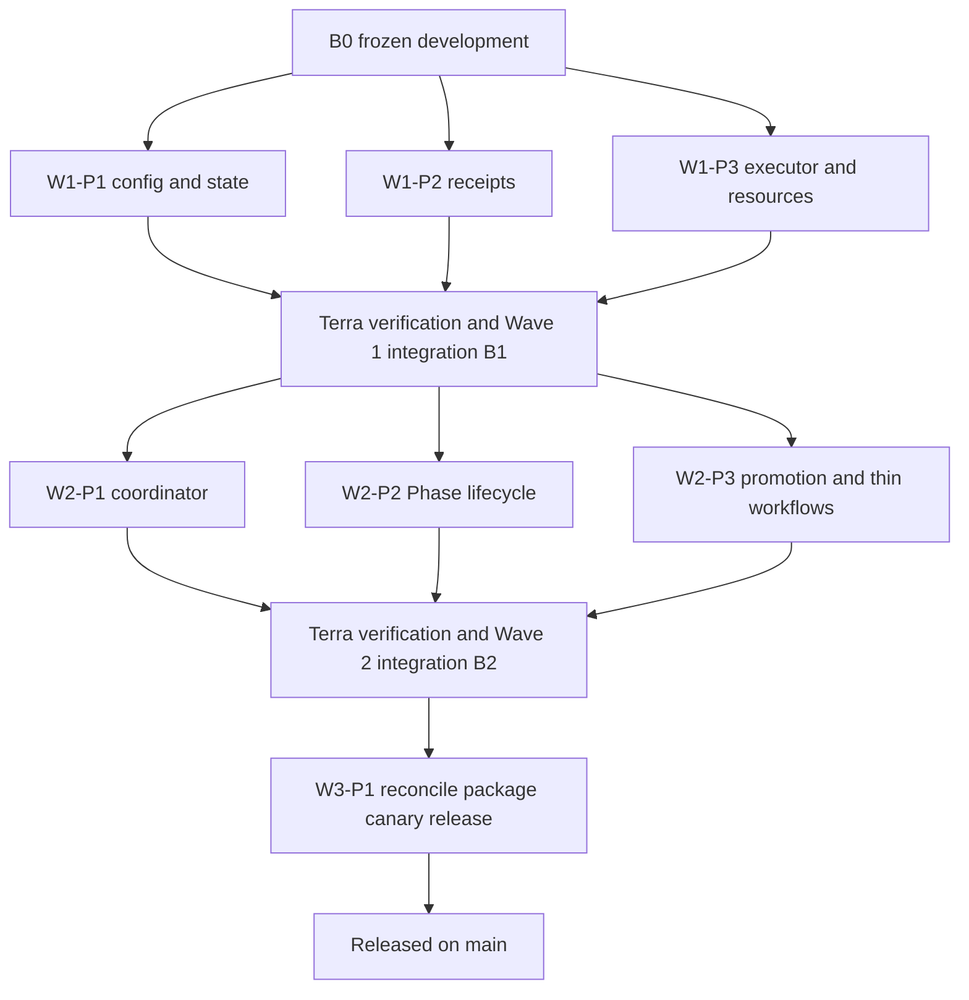

# Streamlined Delivery Implementation Plan

## 1. Objective

Build and release an IDE Development feature that reduces many worker branches to one reviewable Phase PR, moves substantial scheduling from GitHub Actions to a bounded Mac Mini coordinator, runs fast checks on ordinary updates, runs a repository-defined full suite only for the final candidate when needed, reuses exact successful evidence for staging/main, and stops after two failed attempts instead of looping.

The release is developed only in the IDE Development repository. Installing it into consumer repositories is a separate rollout goal.

## 2. Required user-visible behavior

1. A worker creates an `issue/*` branch from the current Phase base.
2. The worker commits and pushes checkpoints as often as useful. Checkpoints do not create PRs or invoke Bugbot.
3. Terra verifies completed Issue tips and merges the passing exact commits into `phase/streamlined-delivery`.
4. One draft Phase PR provides early visibility without starting expensive review.
5. Terra seals the Phase after all intended work is included.
6. The local coordinator validates the exact sealed candidate:
   - fast checks targeted to complete in 300 seconds or less;
   - Cursor Bugbot once after fast checks pass;
   - one repository-defined full suite when required.
7. A successful full suite produces a receipt bound to repository, exact Git tree, dependency digests, test profile, attempt, and evidence digests.
8. The Phase PR merges into `development` only if the exact candidate remains unchanged.
9. Staging is promoted automatically using the receipt plus short release checks.
10. Main supports automatic or principal-approved promotion, with principal approval as the default.
11. A candidate receives at most two actual execution attempts. A sealed Phase receives the original candidate plus one corrected candidate. Further automatic work stops and alerts.
12. Completed, cancelled, timed-out, or obsolete containers and temporary checkouts are removed.

## 3. Architecture

### 3.1 GitHub remains the authority

GitHub continues to own repository history, Issues, PRs, branch protection, commit statuses, review records, and release records. GitHub Actions is an optional compatibility/recovery profile, not the primary scheduler for Mac-managed repositories.

### 3.2 One host coordinator

One versioned coordinator installation on the Mac Mini manages registered repositories. It polls GitHub with conditional requests, stores queue/state in local SQLite, loads execution policy only from a protected default branch, dispatches bounded disposable containers, publishes normal commit statuses, and observes Cursor Bugbot results.

### 3.3 Trust separation

- The privileged coordinator and credentials never execute PR-head code on the host.
- Candidate commands run only in disposable Linux containers.
- Repository policy is read from the protected default branch, not from the candidate branch.
- Candidate files are treated as untrusted data.
- Credentials are not written to repositories, artifacts, summaries, child environments, or logs.

### 3.4 Delivery profiles

- `local-coordinator`: recommended for private repositories on the Mac Mini; no high-churn GitHub workflow cascade.
- `github-actions`: compatibility mode for repositories that cannot use the local coordinator.

### 3.5 Test profiles

- Fast: deterministic checks targeted below five minutes.
- Full: repository-owned application/recovery suite, optional by repository.
- Release: short checks safe to repeat during promotion.

## 4. Attempt and revision policy

An attempt is counted only when a candidate job actually starts execution. Polling, status rereads, queue insertion, deduplication, cancellation before execution, and obsolete-job removal do not increment attempts.

For each `{repository, gate, candidateTree}`:

- attempt 1 may run;
- after a failure, attempt 2 may run;
- after the second failure, state becomes `stopped`, no further automatic dispatch is allowed, and one durable alert is created.

After Phase sealing:

- candidate revision 1 is the original seal;
- candidate revision 2 is the only automatic corrected seal;
- a third revision requires explicit principal authorization.

This prevents an apparent two-attempt policy from becoming an endless series of slightly changed commits.

## 5. Resource policy

Defaults are configurable within validated safe bounds:

- maximum fast jobs: 2;
- maximum heavy jobs: 1;
- heavy jobs never overlap;
- host pressure can reduce concurrency to zero;
- every container has CPU, memory, swap, process, and timeout limits;
- interactive Mac use takes priority;
- nested Docker is allowed only inside a separately bounded disposable environment for an explicitly configured repository;
- startup and shutdown both perform scoped cleanup.

## 6. Branch and concurrent-feature plan

At execution start Terra fetches remote state and records the current `origin/development` as immutable `B0`.

- Integration branch: `phase/streamlined-delivery`.
- Packet branches: runtime-created `issue/<number>-<packet-slug>`.
- Wave 1 packet branches start at `B0`.
- Terra verifies and merges Wave 1 packets, producing `B1`.
- Wave 2 packet branches start at `B1`.
- Terra verifies and merges Wave 2 packets, producing `B2`.
- Wave 3 starts at `B2`, synchronizes the latest `development`, then seals.

The unrelated concurrent feature remains on its own branches and PR. Executors must not merge `development` into their Issue branches, modify other worktrees, or resolve conflicts using blanket incoming/ours strategies. Terra performs one deliberate synchronization before final sealing and preserves both feature lines.

Only Wave 3 may change shared generated/release files such as `VERSION`, `core/managed-core/VERSION`, `INDEX.yaml`, `MANIFEST.json`, generated managed-core copies, and release evidence.

## 7. Waves and dependencies

No Wave 2 packet starts until all Wave 1 packets pass Terra verification and are integrated. No Wave 3 work starts until Wave 2 integration passes.

## 8. Temporary current-system override

The system being replaced must not control this feature's implementation:

- Packet branches are checkpoint-only and do not enter the current Packager.
- Luna agents do not open PRs, mark review-ready, merge, or promote.
- Terra opens one Phase PR directly with normal GitHub authentication after Wave 3 is ready.
- Current scheduled Packager, Integrator, and promotion automation is not used for this feature.
- Required tests and Cursor Bugbot still apply.
- If an obsolete current-system status context alone blocks an otherwise proven merge, Terra may temporarily disable only the exact target-branch rule, perform the normal-authenticated merge, and immediately install/verify the replacement rule.
- Temporary bypass is forbidden for failed tests, failed Bugbot, unresolved conflicts, unknown file identity, or missing evidence.
- Terra captures rulesets before and after every authorized live change.

## 9. Release policy

Wave 3 applies a short promotion lock to `development`, `staging`, and `main`; this does not stop the concurrent feature from continuing on its work branches.

The release sequence is:

1. Phase PR to `development`.
2. Fast gate, Bugbot, and full/not-required gate on exact sealed candidate.
3. Merge to `development`.
4. Automatic staging PR and exact-receipt release gate.
5. Main PR and configured approval gate.
6. Exact-receipt release gate.
7. Merge to `main`.
8. Tag and GitHub Release from verified main.
9. Verify protections, service state, clean repository, and scoped cleanup.

## 10. Definition of done

All conditions are mandatory:

- Multiple accepted Issue branches produce one Phase PR.
- Ordinary checkpoints produce no PR and no Bugbot request.
- Only Terra changes the Phase branch.
- Fast checks have a 300-second target and measured evidence.
- A full suite runs only for the final candidate when the repository requires it.
- Staging/main accept an identical tested tree without rerunning the full suite.
- Any relevant source or dependency change invalidates the receipt.
- Two failed attempts stop and alert exactly once.
- A third sealed candidate is refused without principal authorization.
- Obsolete queued/running work is cancelled.
- One heavy job and at most two fast jobs are enforced.
- No completed test containers or temporary worktrees remain.
- Coordinator restart recovery is proven.
- Local mode does not depend on GitHub Actions scheduling.
- Normal GitHub credentials are used; the former custom App is absent.
- Cursor Bugbot remains independent.
- Existing explicit `issue-pr` and GitHub Actions profiles remain compatible.
- The concurrent feature loses no work.
- IDE Development is promoted through development, staging, and main.
- Branch protections are active with the replacement status contract.
- The next release is tagged and published.
- Final evidence contains packet SHAs, attempts, PRs, merge SHAs, timing, resources, tests, rulesets, service state, release identity, and rollback steps.
